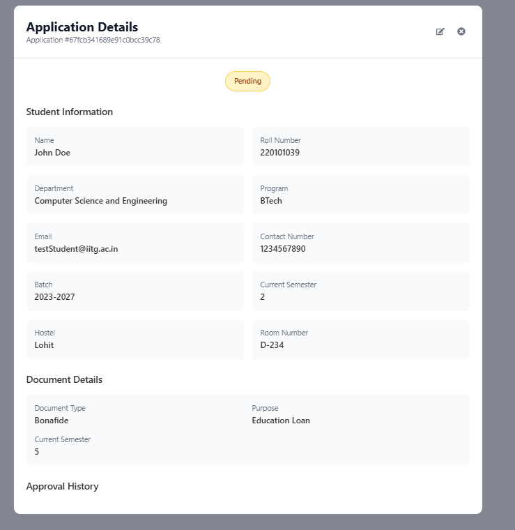

## Admin - Application Details Screen

---

### 1. Overview

This screen provides a comprehensive, read-only view of a specific document application and the associated student's information. It consolidates all relevant details in one place, allowing administrators to thoroughly understand the context of the request before taking action.

---

### 2. Accessing This Screen

You access this detailed view by clicking the **View icon** (usually represented by an eye symbol: `👁️`) in the `ACTIONS` column for a specific application row on the main `Admin - Document Applications Manager` page.

---

### 3. Screen Elements Explained

*   **Title:** `Application Details` - Indicates the purpose of this screen/modal.
*   **Application ID:** (e.g., `Application #67fcb...c78`) - The unique identifier for this specific application request.
*   **Control Icons (Top Right):**
    *   **Edit/Process Icon (Pencil/Square with Arrow):** Click this icon to navigate directly to the `Review Application` screen where you can Approve, Reject, or add remarks to this application.
    *   **Close Icon (X):** Click this to close the `Application Details` view and return to the main `Document Applications Manager` list.
*   **Current Status Tag:** (e.g., `Pending`) - Displays the current processing status of this application.
*   **Student Information Section:** Provides detailed information about the student applicant, pulled from university records:
    *   **`Name`:** Full name of the student.
    *   **`Roll Number`:** Unique identification number of the student.
    *   **`Department`:** The student's academic department (e.g., `Computer Science and Engineering`).
    *   **`Program`:** The academic program the student is enrolled in (e.g., `BTech`).
    *   **`Email`:** The student's registered email address.
    *   **`Contact Number`:** The student's registered phone number.
    *   **`Batch`:** The academic batch or admission year range (e.g., `2023-2027`).
    *   **`Current Semester`:** The student's current academic semester *as per general records* (e.g., `2`).
    *   **`Hostel`:** The name or identifier of the student's assigned hostel (e.g., `Lohit`).
    *   **`Room Number`:** The student's assigned room number (e.g., `D-234`).
*   **Document Details Section:** Provides information specific to this particular application request:
    *   **`Document Type`:** The type of document requested (e.g., `Bonafide`).
    *   **`Purpose`:** The reason stated by the student for needing the document (e.g., `Education Loan`).
    *   **`Current Semester`:** The semester specified *within this application request* (e.g., `5`). *(Note: Admins should verify if this matches the semester in Student Information or if it's relevant to the purpose, like applying for something related to a future semester).*
*   **Approval History Section:** Displays a log of any actions or remarks previously added by administrators for this specific application. If no actions have been taken or remarks added, it might appear empty or state "No remarks available".

---

### 4. How to Use This Screen

1.  **Review Information:** Carefully examine all the details provided in the `Student Information` and `Document Details` sections to understand the full context of the application. Pay attention to the student's status, department, program, and the specific purpose stated for the document request.
2.  **Check History:** Look at the `Approval History` to see if any other administrators have already reviewed or commented on this application.
3.  **Decide Next Step:**
    *   If you need to take action (Approve/Reject), click the **Edit/Process Icon** (pencil/square with arrow) at the top right to go to the `Review Application` screen.
    *   If you only needed to view the details and no action is required from you at this time, click the **Close Icon (X)** at the top right to return to the previous list view.

---

### 5. Important Notes

*   This screen is primarily for **viewing detailed information**. Actions like approving or rejecting are performed on the `Review Application` screen, accessible via the edit icon.
*   **Verify Information:** Use the consolidated information here to verify the legitimacy and context of the request. Note any discrepancies (like differing semester numbers between sections) that might require clarification or influence your decision.
*   The `Approval History` provides valuable context if multiple administrators might be involved in reviewing applications.

---