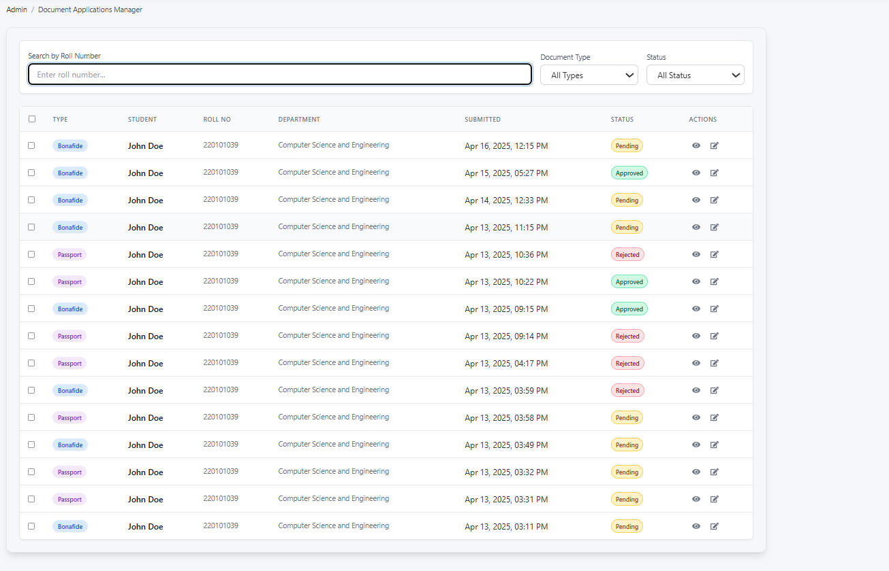
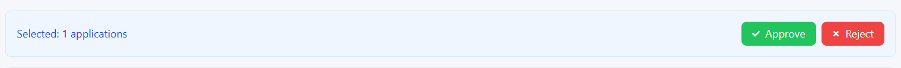

## Admin - Document Applications Manager

---

### 1. Overview

This page is designed for administrators to manage various document applications submitted by students, such as Bonafide Certificates and Passport-related requests. It provides tools to search, filter, view, and process these applications efficiently.

---

### 2. Accessing the Page

This administrative page is typically accessed through the main Admin Dashboard or navigation menu, often under a section related to 'Applications', 'Student Documents', or 'Requests'.

---

### 3. Page Layout and Features

The page consists of two main sections: Filtering/Search controls and the Application List table.

*   **Breadcrumbs:** (e.g., `Admin / Document Applications Manager`) Shows your current location within the admin portal.
*   **Filtering and Search Bar:** Located at the top, this allows you to narrow down the list of applications:
    *   **`Search by Roll Number`:** Enter a specific student's roll number into this field and press Enter (or wait for auto-update) to find all applications submitted by that student.
    *   **`Document Type` Dropdown:** Filter applications based on the type of document requested. Options typically include:
        *   `All Types` (Default): Shows applications for all document types.
        *   `Bonafide`: Shows only Bonafide certificate applications.
        *   `Passport`: Shows only Passport-related applications.
        *   *(Other types may be available)*
    *   **`Status` Dropdown:** Filter applications based on their current processing status. Options typically include:
        *   `All Status` (Default): Shows applications regardless of their status.
        *   `Pending`: Shows applications awaiting review.
        *   `Approved`: Shows applications that have been approved.
        *   `Rejected`: Shows applications that have been rejected.
*   **Application List Table:** Displays the filtered list of document applications with the following columns:
    *   **Checkbox:** Allows selecting individual or multiple applications (potentially for bulk actions, though specific bulk action buttons are not visible in the screenshot).
    *   **`TYPE`:** The type of document requested (e.g., `Bonafide`, `Passport`), often displayed with a distinct colored tag.
    *   **`STUDENT`:** The name of the student who submitted the application.
    *   **`ROLL NO`:** The unique roll number of the student applicant.
    *   **`DEPARTMENT`:** The academic department associated with the student.
    *   **`SUBMITTED`:** The date and time the application was submitted by the student.
    *   **`STATUS`:** The current processing status (`Pending`, `Approved`, `Rejected`), usually indicated by a colored tag corresponding to the status.
    *   **`ACTIONS`:** Provides icons to interact with each individual application:
        *   **View Icon (Eye):** Click this to view the full details of the specific application (e.g., purpose stated by the student, any uploaded supporting documents, history of the request).
        *   **Edit/Process Icon (Pencil/Square with Arrow):** Click this to take action on the application. This typically opens a modal or separate page where you can change the status (e.g., from `Pending` to `Approved` or `Rejected`), add comments or rejection reasons, and save the changes.

---

### 4. How to Use This Page

1.  **Navigate** to the `Document Applications Manager` page within the admin portal.
2.  **Filter/Search (Optional):**
    *   To find applications from a specific student, enter their `Roll Number` in the search box.
    *   To view only a specific type of application (e.g., `Bonafide`), select it from the `Document Type` dropdown.
    *   To view applications with a specific status (e.g., `Pending`), select it from the `Status` dropdown.
    *   You can combine these filters (e.g., show all `Pending` `Bonafide` applications). The table will update automatically or after pressing Enter in the search field.
3.  **Review Applications:** Browse the filtered list in the table. Check the `SUBMITTED` date, `STUDENT` details, and current `STATUS`.
4.  **Process an Application:**
    *   Identify an application needing action (usually one with `Pending` status).
    *   Click the **View Icon (Eye)** in the `ACTIONS` column to review the application details thoroughly.
    *   After reviewing, click the **Edit/Process Icon (Pencil/Square with Arrow)** for that application.
    *   
    

    *   In the editing view/modal:
        *   Change the `Status` to `Approved` or `Rejected` as appropriate.
        *   If rejecting, provide clear reasons in the designated comments/remarks field. You might also add comments upon approval.
        *   Save the changes.
    *   The `STATUS` in the table for that application will update accordingly.

---

### 5. Typical Workflow (Example: Processing Pending Bonafide Requests)

1.  Go to the `Document Applications Manager` page.
2.  Select `Bonafide` from the `Document Type` dropdown.
3.  Select `Pending` from the `Status` dropdown.
4.  The table now lists all pending Bonafide certificate requests.
5.  For each request:
    *   Click the **View Icon** to check the student's details and purpose.
    *   Click the **Edit/Process Icon**.
    *   Update the status to `Approved` or `Rejected`.
    *   Add remarks if necessary (especially for rejections).
    *   Save.
6.  Repeat until all relevant pending requests are processed.

---

### 6. Important Notes

*   Ensure you have the necessary administrative permissions to view and modify application statuses.
*   Be precise when adding rejection reasons, as students will likely see these comments to understand why their request was denied.
*   Changes made here directly affect what the student sees in their application status history.

---