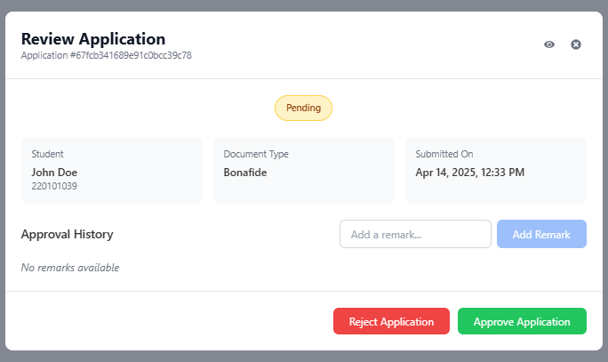

## Admin - Review Application Screen

---

### 1. Overview

This screen allows administrators to review the details of a specific document application (like a Bonafide Certificate or Passport request) and take definitive action: Approve or Reject the application. It also provides a space to add comments or reasons for the decision.

---

### 2. Accessing This Screen

You typically access this screen by clicking the **Edit/Process icon** (usually a pencil or a square with an arrow) in the `ACTIONS` column for a specific application row on the main `Admin - Document Applications Manager` page.

---

### 3. Screen Elements Explained

*   **Title:** `Review Application` - Indicates the purpose of this screen/modal.
*   **Application ID:** (e.g., `Application #67fcb...c78`) - A unique identifier for this specific application request, useful for tracking or reference.
*   **Control Icons (Top Right):**
    *   **View Icon (Eye):** May provide a link back to a more detailed view of the application or related student information (functionality might vary).
    *   **Close Icon (X):** Click this to close the Review Application screen *without* making any changes or taking action.
*   **Current Status Tag:** (e.g., `Pending`) - Displays the status of the application *before* you take action on this screen.
*   **Application Details Section:** Provides a quick summary of the request:
    *   **`Student`:** Shows the name and roll number of the applicant.
    *   **`Document Type`:** Shows the type of document requested (e.g., `Bonafide`).
    *   **`Submitted On`:** Shows the date and time the student submitted this application.
*   **Approval History / Remarks Section:**
    *   **History Area:** (e.g., `No remarks available`) - Displays any previous remarks or comments added by administrators during the review process. As actions are taken, this area will populate.
    *   **`Add a remark...` Input Field:** A text box where you can type comments, reasons for rejection, or notes regarding approval.
    *   **`Add Remark` Button:** Click this button *after* typing in the input field to add your comment to the Approval History *without* approving or rejecting the application yet. This is useful for internal notes or multi-step review processes. *(Note: In some systems, adding a remark might be mandatory before rejecting).*
*   **Action Buttons (Bottom):** These are the final decision buttons:
    *   **`Reject Application` (Red Button):** Click this button to **reject** the application. It is highly recommended, and often required, to add a reason in the 'Add a remark...' field *before* clicking this button.
    *   **`Approve Application` (Green Button):** Click this button to **approve** the application. You can optionally add a remark before clicking Approve.

---

### 4. How to Process an Application Using This Screen

1.  **Review Details:** Carefully check the `Student` information, `Document Type`, and `Submitted On` date. Review any existing `Approval History`.
2.  **Add Remarks (Optional but Recommended):**
    *   If you need to add a comment or *especially* if you plan to reject the application, type your note or reason into the `Add a remark...` field.
    *   You can optionally click `Add Remark` to save the comment to the history before making the final decision, or simply type the remark and proceed to the next step.
3.  **Make Decision:**
    *   **To Approve:** Click the green `Approve Application` button.
    *   **To Reject:** Ensure you have added a clear reason in the remarks field (or do so now), then click the red `Reject Application` button.
4.  **Confirmation:** After clicking `Approve Application` or `Reject Application`, the system will update the application's status. This screen will likely close automatically, returning you to the main `Document Applications Manager` list, where you should see the updated status for the application you just processed.

---

### 5. Important Considerations

*   **Rejection Reasons:** Always provide clear and concise reasons when rejecting an application. The student will likely see these remarks in their application status history and needs to understand why their request was denied.
*   **Accidental Clicks:** If you need to exit without changing the status, use the **Close Icon (X)** at the top right, *not* the Approve or Reject buttons.
*   **Adding Remarks:** Using the `Add Remark` button before Approving/Rejecting can be useful for logging intermediate steps or thoughts during the review process.

---