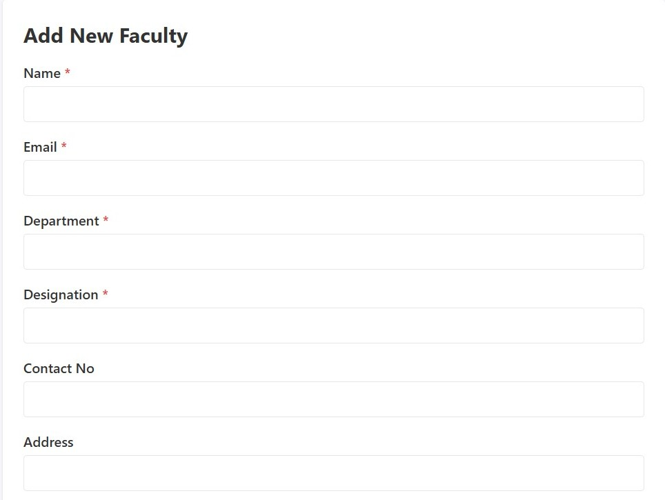
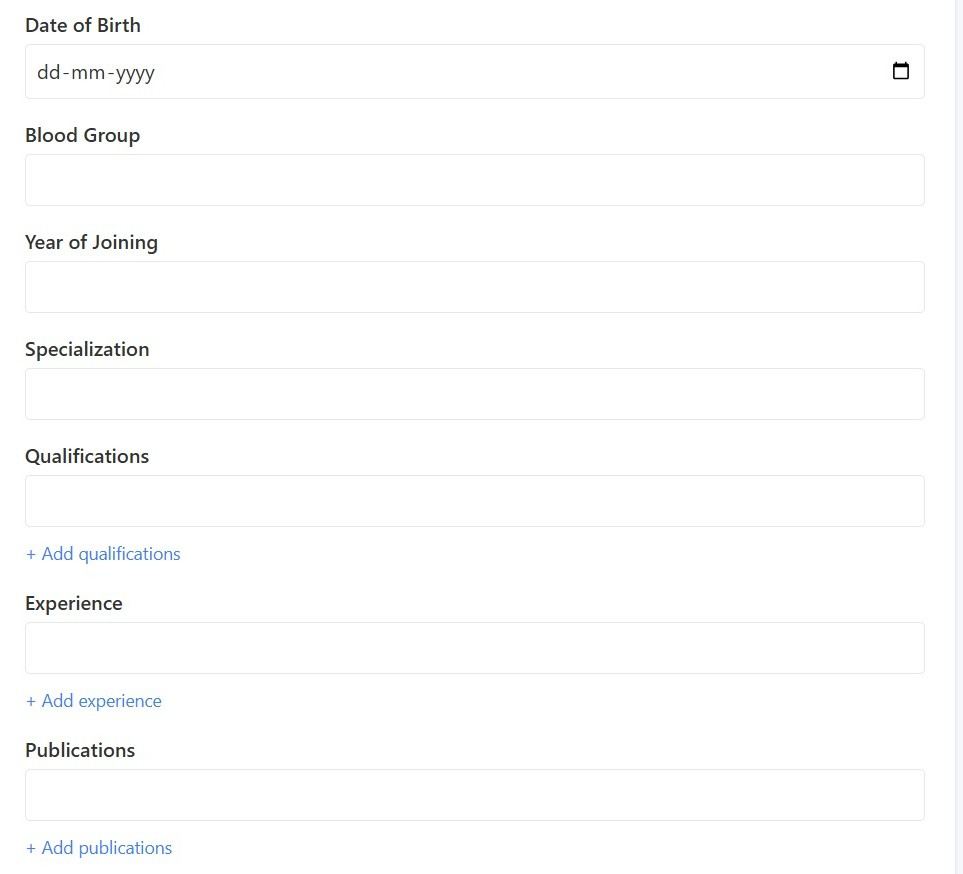
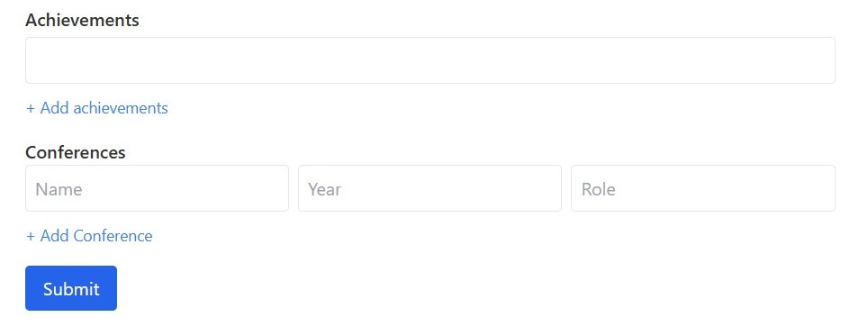

# Add Faculty Feature

## Overview
The Add Faculty feature allows academic administrators to add individual faculty members to the system. 
This feature is accessible through the academic admin section of the application and collects comprehensive information about faculty members.

## Getting Started
Navigate to the "Faculty Management -> Add Faculty" page in the academic admin section of the application.

## Adding Faculty

### Step 1: Complete the Faculty Information Form
Fill out the faculty information form with the following details:

**Required Fields:**
- Name*
- Email* (must end with @iitg.ac.in)
- Department*
- Designation*

**Optional Fields:**
- Contact Number
- Address
- Date of Birth
- Blood Group
- Year of Joining
- Specialization
- Qualifications
- Experience
- Publications
- Achievements
- Conferences

### Step 2: Adding Multiple Entries
For the following fields, you can add multiple entries by clicking the "+ Add" button that appears next to each section:
(If you need to remove an entry that has already been added, simply clear its content by deleting the text)
- Qualifications
- Experience
- Publications
- Achievements
- Conferences

For conferences, you'll need to provide:
- Conference Name
- Year
- Role

### Step 3: Submit the Form
1. Review all information for accuracy
2. Click the "Submit" button at the bottom of the form (Click only once and wait till it is processed)
3. Wait for the system to process your request
4. A confirmation message will appear indicating the faculty was successfully added

## Important Notes
- Email addresses must follow the format: `username@iitg.ac.in` (only letters and . are allowed in the username)
- Date of Birth cannot be set to a future date
- Date of Birth should be chronologically before the Year of Joining (faculty cannot join before being born)
- Year of Joining cannot be later than the current year
- Conference years should be within a reasonable timeframe (not before the faculty's date of birth and not after the current year)
- For multi-value fields (qualifications, experience, etc.), all current entries must be filled before adding a new entry
- All three conference fields (name, year, role) must be completed before adding another conference entry
- The system automatically creates a user account for the faculty member with their email as the default password
- Faculty members should be advised to change their default password upon first login for security purposes
- The faculty's email address must be unique in the system
- The system assumes all data entered is valid administrative information (e.g., department names, designations, etc.)
- All academic information provided (qualifications, specializations, etc.) is assumed to be verified by the academic administrator before entry

## Additional Information
- **Contact Number Format**: Enter digits only, with country code if applicable
- **Blood Group Format**: Use standard notation (e.g., A+, B-, O+, AB+)
- **Data Persistence Warning**: Do not refresh or navigate away from the page during submission as this may result in data loss
- **Privacy Notice**: Faculty information entered will be accessible to authorized administrative personnel only and will be used for institutional purposes
- **After Successful Submission**: You will receive an alert confirming successful addition of the faculty member, and the system will be ready for another entry if needed

## Troubleshooting
- If form submission fails with an alert message, review the form for any validation errors
- If you encounter field validation errors, check the specific format requirements mentioned above
- If the submission fails, check your internet connection and try again