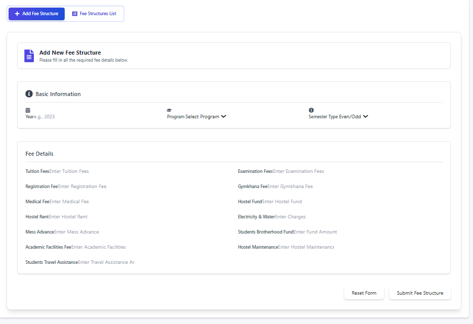
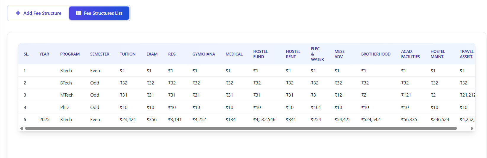

## Fee Structure Management Page

**1. Overview**

This page provides tools for Academic Administrators to manage the fee structures for various academic programs within the institution. You can add new fee structures for specific years and programs, and view a comprehensive list of all existing fee structures currently stored in the system.

--- 

**2. Page Layout and Navigation**

The page is organized into two main sections accessible via tabs:

*   **Tabs:** Located near the top of the page, these allow you to switch between the two primary functions:
    *   <button><FaPlus /> Add Fee Structure</button>: Select this tab to access the form for entering a new fee structure.
    *   <button><FaListAlt /> Fee Structures List</button>: Select this tab to view a table listing all previously entered fee structures.

--- 
**3. "Add Fee Structure" Tab**

This section allows you to define and save a new fee structure for a specific academic year and program.

*   **Purpose:** To input the detailed breakdown of fees applicable to students in a particular program for a given year (and optionally, for a specific semester type - Even/Odd).

*   **Sections:**
    *   **Header:** Confirms you are in the "Add New Fee Structure" section.
    *   **Basic Information:** Captures the core identifiers for the fee structure:
        *   **Year:** The academic year this fee structure applies to (e.g., 2025). *Required*.
        *   **Program:** Select the academic program (e.g., BTech, MTech, PhD) from the dropdown list. *Required*.
        *   **Semester Type:** (Optional) Specify if this fee structure applies only to Even semesters (select "Even"), Odd semesters (select "Odd"), or leave blank if it applies regardless of the semester type (or if the distinction isn't needed).
    *   **Fee Details:** Contains input fields for *all* individual fee components. You must enter a numeric value for each:
        *   Tuition Fees
        *   Examination Fees
        *   Registration Fee
        *   Gymkhana Fee
        *   Medical Fee
        *   Hostel Fund
        *   Hostel Rent
        *   Electricity & Water
        *   Mess Advance
        *   Students Brotherhood Fund
        *   Academic Facilities Fee
        *   Hostel Maintenance
        *   Students Travel Assistance
        *   *Note: All fields in this section are required.*

*   **Actions:**
    *   **Reset Form Button:** Clears all input fields in the form, allowing you to start over.
    *   **Submit Fee Structure Button:** Validates the entered data. If all required fields are filled correctly, it saves the new fee structure to the system.

*   **Feedback:**
    *   **Validation Errors:** If you miss a required field or enter invalid data, an error message will appear below the respective field in red text.
    *   **Success/Error Messages:** After clicking "Submit", a notification (toast message) will appear at the top/bottom of the screen indicating whether the structure was added successfully or if an error occurred during saving.

--- 
**4. "Fee Structures List" Tab**

This section displays a read-only table listing all fee structures that have been previously saved in the system.

*   **Purpose:** To provide a consolidated view of all defined fee structures for reference and verification.

*   **Loading Data:** The list is automatically fetched from the server when you switch to this tab. A "Loading fee structures..." message may appear briefly.

*   **Table Columns:** The table displays the following information for each entry:
    *   **Sl.:** Serial number for the row.
    *   **Year:** The academic year.
    *   **Program:** The academic program.
    *   **Semester:** Indicates if the structure applies to "Even", "Odd", or "Both" (if Semester Type was left blank during entry).
    *   **Fee Components:** Separate columns showing the monetary amount (prefixed with ₹) for each fee type (Tuition, Exam, Reg., Gymkhana, Medical, Hostel Fund, Hostel Rent, Elec. & Water, Mess Adv., Brotherhood, Acad. Facilities, Hostel Maint., Travel Assist.).

*   **Error Handling:** If there's an issue fetching the data, an error message will be displayed instead of the table.
--- 
**5. How to Use the Page**

*   **To Add a New Fee Structure:**
    1.  Click the **"Add Fee Structure"** tab.
    2.  Enter the applicable **Year** in the "Basic Information" section.
    3.  Select the **Program** from the dropdown list.
    4.  (Optional) Select the **Semester Type** (Even/Odd) if the fees differ between semester types. Leave blank if it applies to both.
    5.  Carefully enter the numeric amount for *every* field listed under "Fee Details".
    6.  Review all entries for accuracy.
    7.  Click the **"Submit Fee Structure"** button.
    8.  Check the notification message to confirm successful submission. If errors occur, correct the highlighted fields and resubmit.

*   **To View Existing Fee Structures:**

    
    
    1.  Click the **"Fee Structures List"** tab.
    2.  Wait for the table to load (a loading message may appear).
    3.  Scroll through the table horizontally and vertically to view all defined fee structures and their detailed breakdowns.
--- 
**6. Important Notes**

*   **Permissions:** This page is intended for users with administrative privileges for managing academic fee data.
*   **Data Accuracy:** Ensure all fee amounts entered are accurate, as this data will likely be used for student fee calculations and records.
*   **Completeness:** All fee component fields under "Fee Details" are mandatory when adding a new structure.
*   **Read-Only List:** The "Fee Structures List" tab is for viewing only. To modify an existing structure, you might need to consult system documentation for update/delete procedures (which are not present on this specific page) or potentially add a new corrected entry for the same year/program if updates aren't supported directly.

---