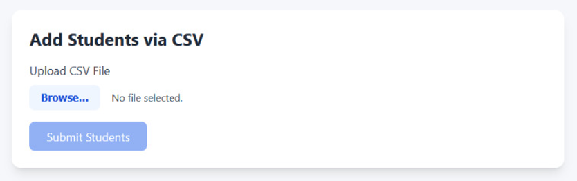

# Add Student via CSV Upload Feature

## Overview
The Student CSV Upload feature allows academic administrators to add multiple student records to the system at once by uploading a CSV file. This is especially useful at the beginning of academic terms when many new students need to be added to the system.

## Getting Started
Navigate to the "Add Students" page in the academic admin section of the application.

## Uploading Students
### Step 1: Prepare Your CSV File
Prepare a CSV file with the following student information:
- name
- email
- contactNo
- address
- dateOfBirth
- bloodGroup
- rollNo
- fatherName
- motherName
- department
- semester
- batch
- program
- hostel
- roomNo

Note: The following fields are required:

name
email
rollNo
fatherName
motherName
department
batch
program
hostel
roomNo

**Note:** The fields in the csv file should be same as written above. These are case sensitive (as they written in the same manner in model.js for student and user).

### Step 2: Upload the CSV File
1. Click on the "Browse" button 
2. Select your CSV file from your computer
3. Once uploaded, the file will appear beneath the upload area
4. If you selected the wrong file, click the "Remove File" button to start over

### Step 3: Review Student Data
After uploading, a table will display showing all student records extracted from the CSV file. Review this information carefully to ensure all data is correct.

### Step 4: Submit the Data
1. Click the "Submit Students" button at the bottom of the page
2. Wait for the system to process your request
3. A confirmation message will appear indicating how many students were successfully added
4. The page will reset, allowing you to upload another file if needed

**Note:** The "Submit Students" button is disabled if a file is not uploaded and is enabled once a file has been uploaded. Similarly, the "Browse" is disabled once a file has been uploaded indicating that only one file can be uploaded at a time.

## Important Notes
- The Admin is required to give the csv file with correct data for example the Programme should is BTech it should be written as BTech only and not as Btech. 
- Students with incomplete required information will be skipped during the import
- Students with email addresses or roll numbers that already exist in the system will be skipped
- Wait for a small time after clicking on "Submit Students" allowing your request to process correctly
- For each student added, the system automatically creates user accounts with their roll number as the initial(default) password
- It is recommended to advise new students to change their passwords upon first login

## Troubleshooting
- If no data appears after uploading your CSV, ensure your file has the correct header names
- If the submission fails, check your internet connection and try again