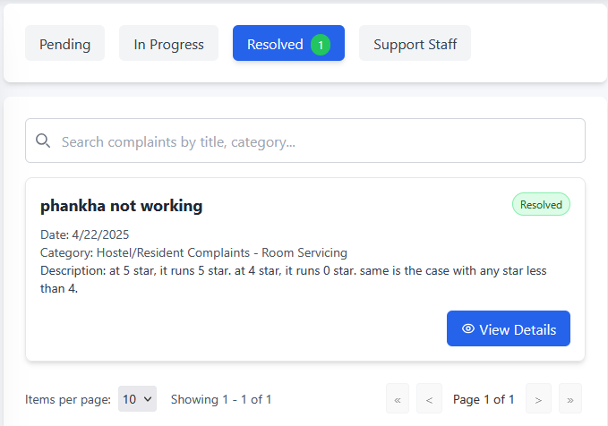

# Complaint System

This interface provides tools for viewing, searching, and managing user-submitted complaints.

## Filtering Tickets

Use the tabs at the top to filter the tickets based on their current status:

*   **Pending:** Tickets awaiting action.
*   **In Progress:** Tickets currently being worked on.
*   **Resolved:** Tickets that have been completed or closed. A count of tickets in this status may be shown next to the tab name (e.g., `Resolved 1`).
*   **Support Staff:** Filter by assigned staff if applicable.

The currently active tab is highlighted (e.g., the blue **Resolved** tab in the image).

## Searching and Viewing Tickets

*   **Search:** Use the search bar (labeled `Search complaints by title, category...`) to find specific tickets by keywords.
*   **Ticket Information:** Each ticket is displayed as a card showing key details:
    *   Title (e.g., **phankha not working**)
    *   Date Submitted
    *   Category
    *   Description (partial or full)
    *   Status Badge (e.g., the green `Resolved` badge)
*   **View Full Details:** Click the **View Details** button on a ticket card to access the complete information and management options for that specific ticket.

## Pagination

If there are numerous tickets, use the controls at the bottom of the list:

*   **Items per page:** Select how many tickets to display on each page using the dropdown menu.
*   **Navigation:** Use the arrow buttons (`<<`, `<`, `>`, `>>`) and the page number indicator (e.g., `Page 1 of 1`) to browse through the list of tickets.