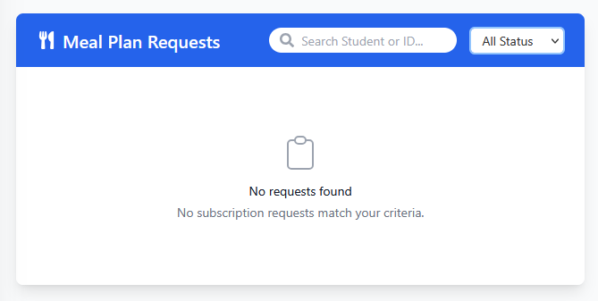

# Mess

This section is used to find and review student requests related to meal plan subscriptions.

## Finding Specific Requests

Use the controls within the blue header bar to locate requests:

*   **Search by Student:** Enter a student's name or ID number into the **Search Student or ID...** field.
*   **Filter by Status:** Use the **All Status** dropdown menu to narrow down the list based on the request status (e.g., Pending, Approved, Denied, All).

## Viewing the Request List

The main content area below the header bar displays the meal plan requests that match your current search and filter criteria.

*   **Request Display:** Matching requests will be listed in this space (no requests are shown in the example image).
*   **No Results:** If no requests match your search or filter settings, an icon and informative messages like "No requests found" and "No subscription requests match your criteria." will be displayed, as depicted in the image.