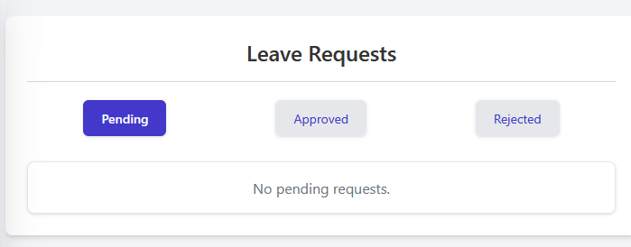

# Leave Request Management

This section allows you to view and manage employee leave requests based on their status.

## Viewing Requests by Status

To view leave requests, use the status filter buttons located below the main heading:

*   **Pending:** Click this button to view requests that are awaiting approval or rejection.
*   **Approved:** Click this button to view requests that have been approved.
*   **Rejected:** Click this button to view requests that have been rejected.

The currently selected status button will be highlighted (e.g., the dark blue **Pending** button in the image).

## Request Display Area

Below the status buttons, the system displays the leave requests corresponding to the selected filter.

*   **List of Requests:** If requests exist for the selected status, they will be listed in this area (details not shown in the example image).
*   **No Requests Message:** If there are no requests matching the selected status, a message like "No pending requests." will be displayed, as shown in the image under the selected **Pending** tab.