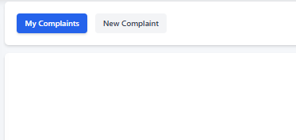
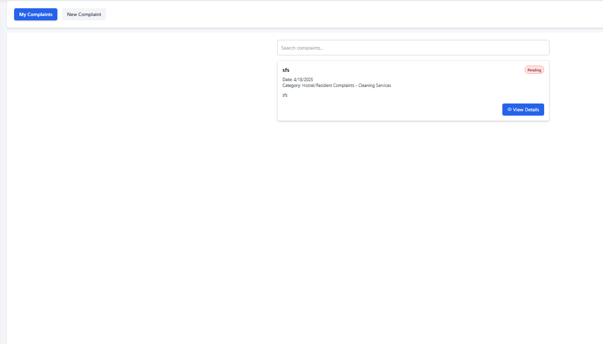
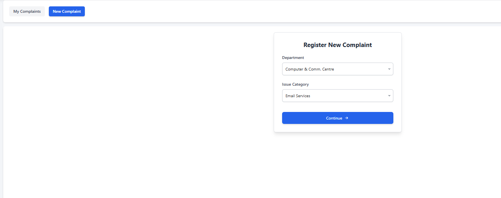
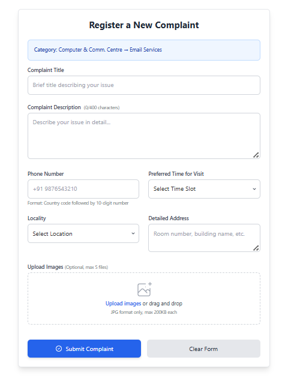

# Complaint Module

## 1. Overview

This system allows you to submit, track, and manage complaints related to hostel or campus facilities. You can monitor your complaint status from submission through resolution and communicate with assigned support staff.

---

## 2. Navigation

The system has two main sections accessible via the tabs at the top:

- **My Complaints:** View and track all your submitted complaints
- **New Complaint:** Submit a new complaint

---

## 3. Managing Your Complaints

### Viewing Your Complaints

When you click on the "My Complaints" tab, you can see a list of all complaints you've submitted.

- The search bar allows you to filter complaints by keywords
- If you haven't submitted any complaints yet, you'll see a "No complaints found" message

### Complaint Statuses

Each complaint will have one of these statuses:

- **Pending** (🔴): Your complaint has been submitted but not yet assigned to staff
- **In Progress** (🟡): Your complaint has been assigned and is being addressed
- **Resolved** (🟢): Your complaint has been successfully resolved

### Viewing Complaint Details

When you select a complaint from the list, you'll see a detailed view that includes:

- **Title and Status:** At the top of the page with color-coded status indicator
- **Complaint Details:** Date submitted, category, and sub-category
- **Contact Information:** Your phone number and hostel room address
- **Description:** The detailed explanation of your issue
- **Images:** Any photos you uploaded with your complaint
- **Assigned Staff Information:** (when applicable) Name and contact of the support staff

### Deleting a Complaint

You can only delete complaints that are still in "Pending" status:

1. Open the complaint details
2. Click the "Delete" button in the header
3. Confirm deletion when prompted

---

## 4. Submitting a New Complaint

### Step 1: Select Department and Category

First, choose the appropriate department and issue category for your complaint.

1. Click on the "New Complaint" tab
2. Select the department (e.g., "Hostel/Resident Complaints")
3. Select the issue category (e.g., "Cleaning Services")
4. Click "Continue"

### Step 2: Complete the Complaint Form

After selecting the department and category, fill out the complete complaint form.

The form includes:

1. **Category:** Automatically filled based on your previous selection
2. **Complaint Title:** A brief title describing your issue
3. **Complaint Description:** Detailed explanation (limited to 600 characters)
4. **Phone Number:** Your contact number with country code
5. **Preferred Time for Visit:** Select a convenient time slot
6. **Locality:** Select your location
7. **Detailed Address:** Specify your room number and building name
8. **Upload Images:** (Optional) Add up to 5 images (JPG format, max 200KB each)
   - Click "Upload images" or drag and drop files

### Step 3: Submit Your Complaint

Once you've completed all required fields:

1. Review your information for accuracy
2. Click "Submit Complaint" to register your complaint
3. If you need to start over, click "Clear Form"

---

## 5. Understanding the Complaint Process

After submitting your complaint:

1. It will appear in your "My Complaints" list with "Pending" status
2. An administrator will review and assign it to qualified support staff
3. Once assigned, the status changes to "In Progress"
4. You can view the assigned staff's contact information in the complaint details
5. The staff will work on resolving your issue
6. When resolved, the status will change to "Resolved"

---

## 6. Tips for Effective Complaints

- **Be specific** in your description
- **Include clear images** when applicable
- **Provide accurate contact information** and time availability
- **Choose the correct department and category** to ensure proper routing
- **Check your complaint status regularly** for updates
