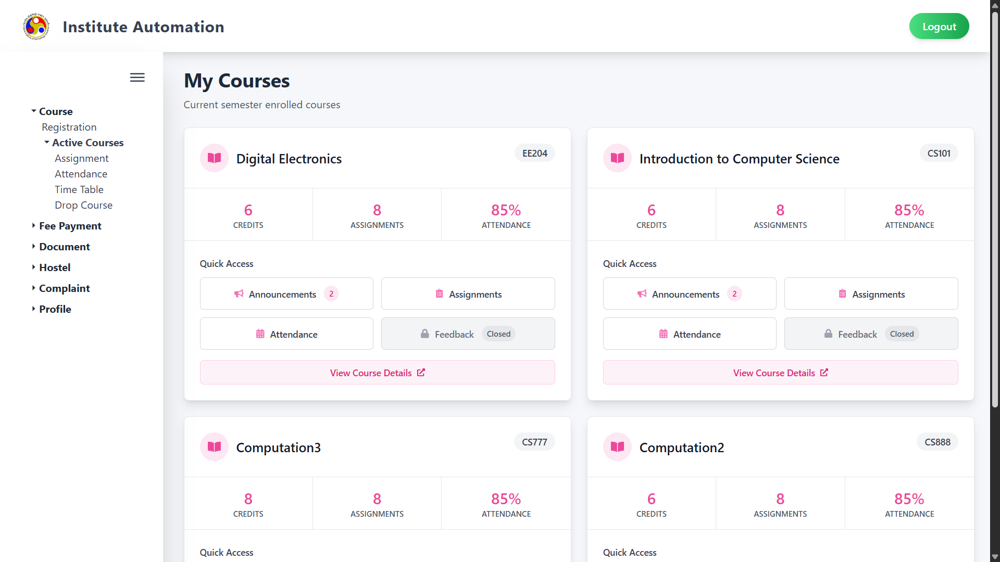
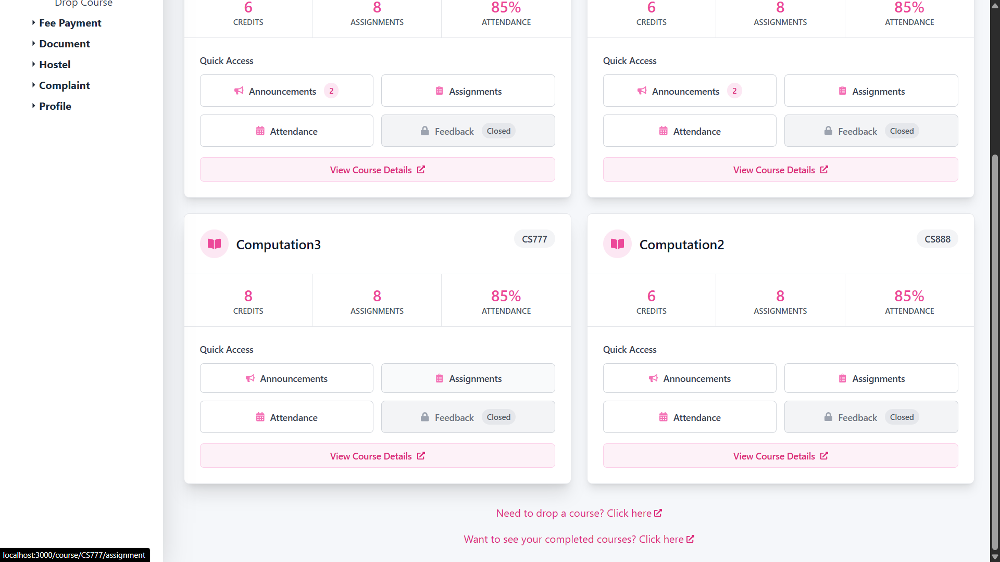
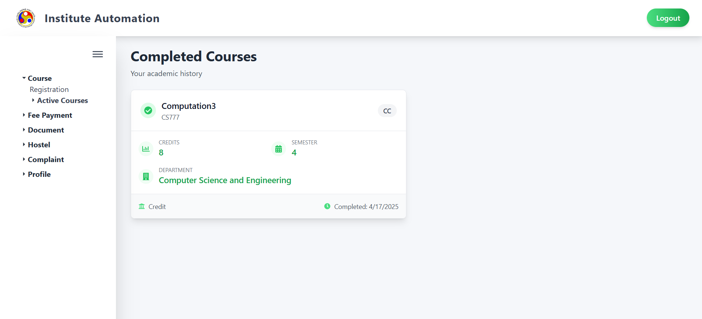

# Active Courses Module

## 1. Overview

The **Courses** module provides students with a comprehensive view of all their academic courses, both active and completed. This section is designed for seamless navigation, giving users quick access to course details, resources, and registration information.

---

## 2. Page Layout

The **Courses** section is accessible from the main sidebar and is divided into two key tabs: **Active Courses** and **Completed Courses**.

---

### 2.1 Active Courses Page

This page displays a list of all ongoing courses in a scrollable format. Each course is represented as a rectangular card with the following information:

- **Course Code** (e.g., CS517)
- **Course Title** (e.g., Programming Languages Lab)
- **Instructor Name** (e.g., Prof. XYZ)
- **Type of Course** (e.g., Lab, Lecture)
- **Semester Timeline** (e.g., Jan 2025 – Apr 2025)

#### Features

- **Responsive Grid:** Courses are laid out in a scrollable card grid.
- **Intuitive Design:** Easy to scan for current coursework.
- **Clickable Cards:** Clicking on any course redirects the user to a detailed course view.

---

### 2.2 Completed Courses Page

This tab displays a grid of all courses the student has completed in past semesters.

#### Each course card includes:

- **Course Code and Title**
- **Instructor Name**
- **Type of Course**
- **Term Completed** (e.g., Jul 2024 – Nov 2024)
- **Status:** These courses are marked as completed, and no further actions are available.

#### Features

- **Clear Distinction:** The “Completed” label is visually distinct from active courses.
- **Read-Only Cards:** These cards are static and meant for reference only.
- **Course History:** Helpful for tracking academic progress over time.

---

## 3. Behavior and Functionality

- **Data Sync:** All course information is dynamically synced from the institute's academic backend.
- **Tab Persistence:** The selected tab (Active/Completed) remains active on return visits.
- **Course Sorting:** Courses are auto-sorted chronologically based on term duration.

---

## 4. Notes

- **Registration Management:** Course drop functionalities are  available in the bottom of  this module.
- **View Only:** This section is meant for tracking and reference; no edits can be made here.
- **Mobile Optimization:** The interface is fully responsive and works on both mobile and desktop.

---

