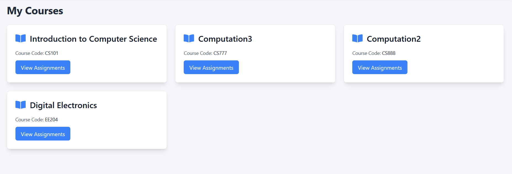
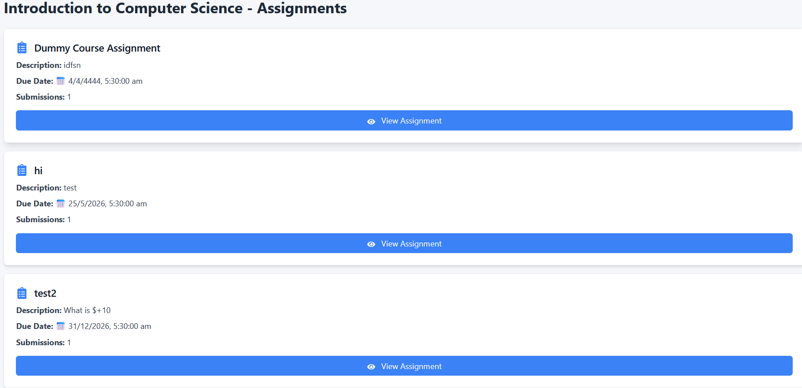
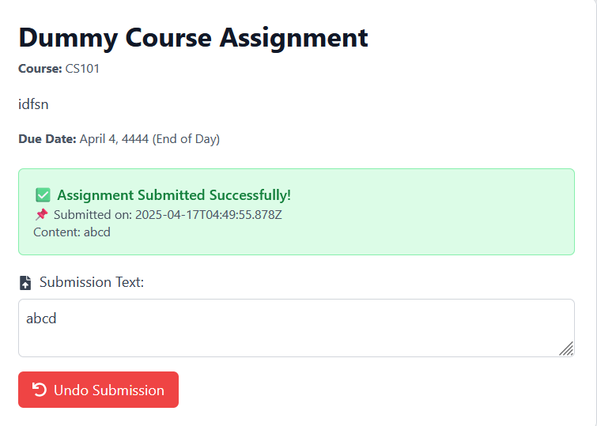
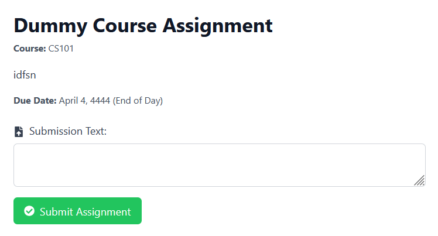

# Assignment Module

## 1. Overview

This page allows you to view, submit, and track course assignments. It provides a streamlined interface to view assignment details, submit responses, and manage submissions efficiently for each course.

---

## 2. Page Layout

When you navigate to the **Assignments** page of a course, you will see the following key sections:

- **Title:** Displays the heading "My Courses" at the top.
- **Assignment Cards:** Each assignment for the course is shown in a card format.
- **Assignment Information:**
  - **Title:** Name of the assignment (e.g., “Dummy Course Assignment”).
  - **Description:** Brief note or instructions provided by the instructor.
  - **Due Date:** The deadline by which the assignment must be submitted.
  - **Submissions:** Number of students who have already submitted the assignment.
- **View Assignment Button:** A button on each card to navigate to the assignment detail page.
- **Loading/Error States:** When assignments are being fetched, a loading indicator may be shown. If there's a problem fetching assignments, an error message is displayed.

---

## 3. Features and How to Use Them

### 3.1 Viewing Assignments List

This page shows the list of all courses registered by a student. 
After selecting a course, go to the **View Assignments** tab to see all active and past assignments.

Each assignment card shows:

- **Title**
- **Description**
- **Due Date**
- **Submissions Count**
- **View Assignment** – click to access the assignment detail and submission page.

---

### 3.2 Viewing and Submitting an Assignment (Assignment Detail Page)

Click the **"View Assignment"** button on any card to go to that assignment’s detailed page.

This page contains:

1. **Assignment Information:**
   - **Title, Course Code**
   - **Instructions/Description** (if provided)
   - **Due Date:** Clearly shown (e.g., "April 4, 4444 – End of Day")

2. **Submission Status Area:**
   - If you have submitted the assignment:
     - A green success box is displayed with:
       - **Submission Successful** message  
       - **Submission Timestamp**  
       - **Submitted Content**
   - If not submitted yet:
     - You will see a blank text area for submission.

3. **Submission Text Field:**
   - A large text input box where you type your assignment response.
   - You may edit this field freely before submission.

4. **Submit / Undo Buttons:**
   - **Submit Assignment:** Appears if no submission has been made yet.
     - Click to submit your assignment.
     - A success message will confirm submission and show your input.
     
   - **Undo Submission:** Appears after submission.
     - Click to delete your current submission and re-enter new content.
     - Once undone, the form will become editable again.

---

## 4. Validation and Behavior

- **Empty Submissions:** The system does not allow empty submissions.
- **Multiple Submissions:** Only one submission is allowed at a time. You must undo a submission before submitting again.
- **Due Date Visibility:** Although the due date is shown, late submissions handling depends on instructor settings.

---

## 5. Important Notes

- **Save Before Submitting:** Ensure your content is finalized before submitting. Once submitted, the field becomes read-only unless undone.
- **Late Submissions:** While the system may allow submission past the due date, instructors may penalize late entries. Follow your course policy.
- **Undo Submission:** Use this only if you need to edit and re-submit. Once undone, your earlier submission is deleted.
- **Confirmation:** A timestamp is saved and shown with your submission to confirm your submission time.
-**Contact:** For questions about an assignment or submission issues, reach out to the course instructor or teaching assistant.

---

