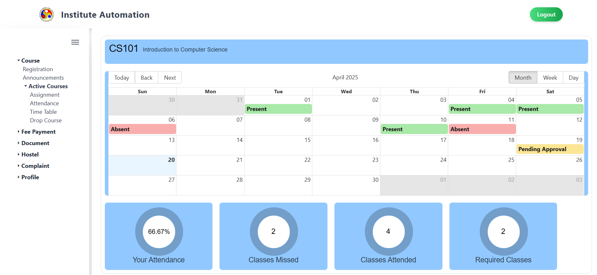

# Attendance Module

## 1. Overview

This module allows students to track their attendance across all registered courses and view detailed attendance records for each course. It offers a clean and interactive interface that helps students monitor their academic presence and receive warnings in case of low attendance.

---

## 2. Page Layout

When you navigate to the **Attendance** section from the sidebar, you will first see the **Attendance Courses Page**, which gives a quick summary of attendance for all courses.

### 2.1 Attendance Courses Page

This page contains the following elements:

- **Page Title:** Displayed at the top as “Attendence”.
- **Attendance Warning:** If the student is short on attendance in any course, a red banner saying **“You are short of Attendance!”** appears prominently at the top.
- **Course Cards:** Each registered course is displayed in a card format with the following:
  - **Course Code** (e.g., CS101)
  - **Attendance Percentage** shown using a circular progress chart.
- **Navigation:** Clicking on any course card redirects you to the detailed view of that course’s attendance.

---

## 3. Features and How to Use Them

### 3.1 Viewing Overall Attendance

This view helps you quickly assess your attendance status across all courses:

- Each course card gives an instant view of your attendance percentage.
- If you are in danger of falling below the attendance threshold, a warning banner is shown.
- Use this view regularly to stay updated on where your attendance needs improvement.

---

### 3.2 Viewing Detailed Attendance for a Course

Clicking on any course card will open the **Course Attendance Detail Page** for that course.

This page is designed to give an in-depth overview of your attendance in a single course and contains the following sections:

#### 3.2.1 Course Header

- The **course code** and **course name** are displayed prominently at the top of the page.

#### 3.2.2 Weekly Timetable View

- A **weekly calendar** (e.g., April 13 – April 19) shows the scheduled classes.
- The timetable allows students to visually see when classes were scheduled.

#### 3.2.3 Attendance Summary Indicators

Below the calendar, there are three circular visual components showing:

1. **Your Attendance**
   - Displays the overall attendance percentage in this course (e.g., 0%).
2. **Classes Missed**
   - Shows the number of classes missed.
3. **Classes Attended**
   - Shows the number of classes attended.

Each indicator is color-coded and helps you evaluate your progress at a glance.

---

## 4. Validation and Behavior

- **Real-Time Updates:** Attendance is updated dynamically as new data is recorded by instructors.
- **Low Attendance Warning:** The system automatically shows a banner if any course drops below the threshold.
- **Course Navigation:** You can switch between courses by going back to the main Attendance page.

---

## 5. Important Notes

- **Attendance Policy:** Be aware of the minimum attendance requirement for each course. Falling short may lead to academic penalties.
- **Update Frequency:** Attendance data is updated periodically by instructors. Check regularly to avoid surprises.
- **Technical Issues:** If you find missing or incorrect attendance records, report the issue to your instructor or academic coordinator.
- **Mobile Friendly:** The interface is optimized for both desktop and mobile screens for convenient tracking on the go.
- **Accessibility:** Circular indicators and color-coded visuals ensure clarity and quick understanding for all users.

---
