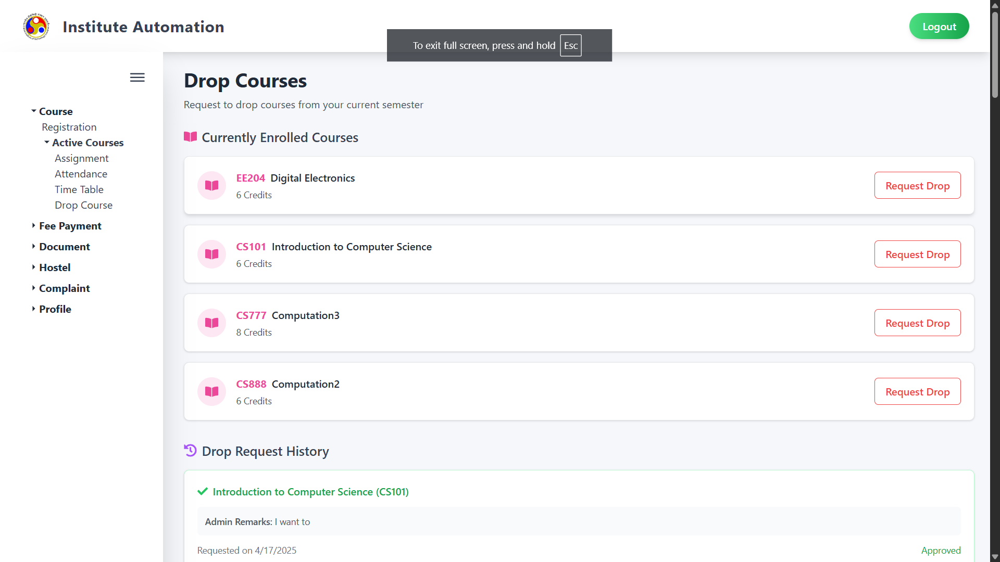
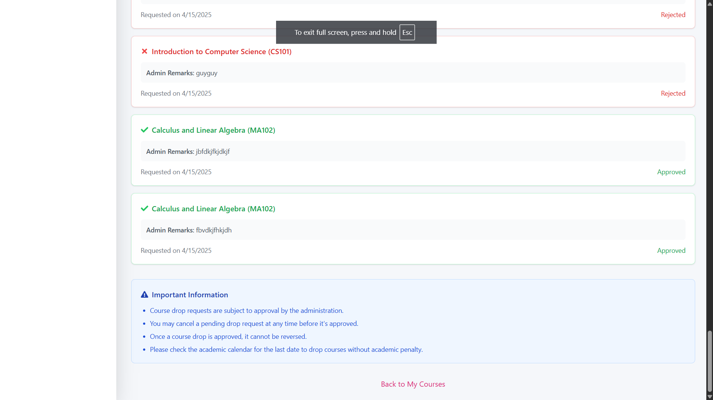

# Drop Courses Module

## 1. Overview

The Drop Courses module allows students to request the removal of one or more enrolled courses for the current semester. It offers an intuitive interface to initiate, track, and manage drop requests.

---

## 2. Navigation Path

Access this module via the sidebar:

`Course → Active Courses → Drop Course`

---

## 3. Page Layout

The interface is divided into two main sections:

- **Currently Enrolled Courses**
- **Drop Request History**

---

## 4. Features and Usage

### 4.1 Currently Enrolled Courses

This section displays a list of all courses registered for the semester. Each course is shown with:

- **Course Code and Title** (e.g., CS101 – Introduction to Computer Science)
- **Credits**
- A red **Request Drop** button to initiate a drop request

**Action:**
Clicking **Request Drop** initiates a request for the selected course. Depending on the configuration, you may need to enter a reason or confirm your submission.

---

### 4.2 Drop Request History

This section maintains a record of all course drop requests made by the student.

Each request displays:

- **Course Title and Code**
- **Admin Remarks** (if provided)
- **Request Date**
- **Status:** One of the following:
  - ✅ **Approved** – Course has been successfully dropped
  - ❌ **Rejected** – Drop request was denied
  - ⏳ **Pending** – Awaiting approval (not shown in the current screenshots, but may appear in real use)

---

## 5. Visual Indicators

- ✅ **Green Card**: Approved drop request  
- ❌ **Red Card**: Rejected drop request  
- 🔄 **Neutral Card** (if applicable): Pending drop request  
- Admin remarks are shown under each request to give context for the approval or rejection

---

## 6. Important Information

At the bottom of the page, a blue info box provides key rules for course drop requests:

- 🔹 Drop requests require **admin approval**
- 🔹 **Pending requests** can be canceled before approval
- 🔹 **Approved drops are final** and **cannot be reversed**
- 🔹 Check the **academic calendar** for drop deadlines to avoid academic penalties

---

## 7. Tips

- Be careful while submitting multiple drop requests for the same course.
- Regularly check the Drop Request History to monitor status updates.
- Read admin remarks for better clarity on rejected requests.
- Don't forget to confirm the drop deadlines on the academic calendar.

---

## 8. Navigation

Use the **Back to My Courses** button at the bottom to return to your main course dashboard after reviewing or submitting drop requests.

---
