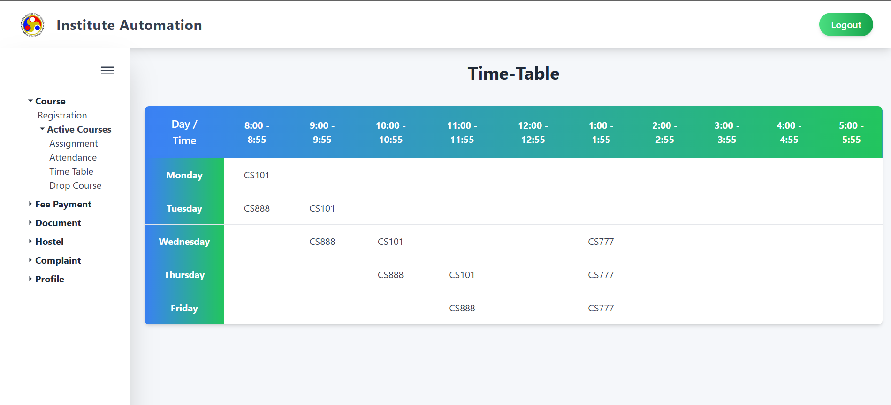

# Time Table Module

## 1. Overview

This page allows you to view the weekly schedule of courses at the Institute Automation. It provides a clear and organized interface to check the timetable for each day and the corresponding course codes.

---

## 2. Page Layout

When you navigate to the **Time Table** page, you will see the following key sections:

- **Title:** Displays the heading "Time-Table" at the top.
- **Sidebar Menu:** Options include Course Registration, Active Courses, Assignment, Attendance, Time Table, Drop Course, Fee Payment, Document, Hostel, Complaint, and Profile.
- **Timetable Grid:** A table showing the schedule with days (Monday to Friday) and time slots from 8:00 - 5:55.
- **Logout Button:** Located at the top right for user logout.

---

## 3. Features and How to Use Them

### 3.1 Viewing the Timetable

The timetable displays the course codes scheduled for each day and time slot:

- **Days:** Monday, Tuesday, Wednesday, Thursday, Friday.
- **Time Slots:**  
  8:00 - 8:55  
  9:00 - 9:55  
  10:00 - 10:55  
  11:00 - 11:55  
  12:00 - 12:55  
  1:00 - 1:55  
  2:00 - 2:55  
  3:00 - 3:55  
  4:00 - 4:55  
  5:00 - 5:55

- **Course Codes:**  
  - **Monday:** CS101 (8:00 - 8:55)  
  - **Tuesday:** CS888 (8:00 - 8:55), CS101 (9:00 - 9:55)  
  - **Wednesday:** CS888 (8:00 - 8:55), CS101 (9:00 - 9:55), CS777 (1:00 - 1:55)  
  - **Thursday:** CS888 (9:00 - 9:55), CS101 (10:00 - 10:55), CS777 (1:00 - 1:55)  
  - **Friday:** CS888 (10:00 - 10:55), CS777 (1:00 - 1:55)

---

## 4. Validation and Behavior

- **Empty Slots:** Any time slot without a course code indicates no class is scheduled.
- **Time Slot Consistency:** Each course is scheduled within a single time slot per day.

---

## 5. Important Notes

- **Schedule Updates:** The timetable may be updated by the institute. Check regularly for changes.
- **Contact:** For any discrepancies or questions about the timetable, reach out to the institute administration or your course coordinator.

---
