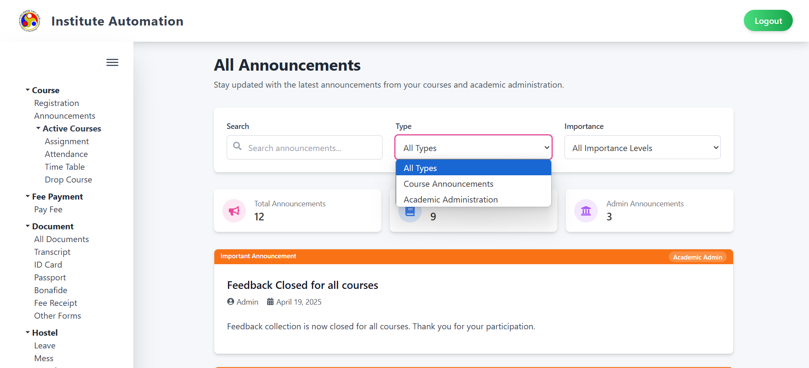
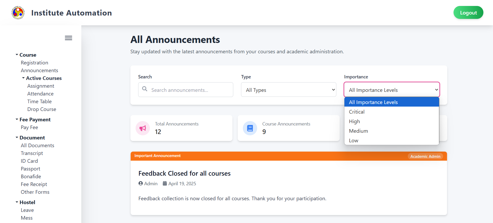
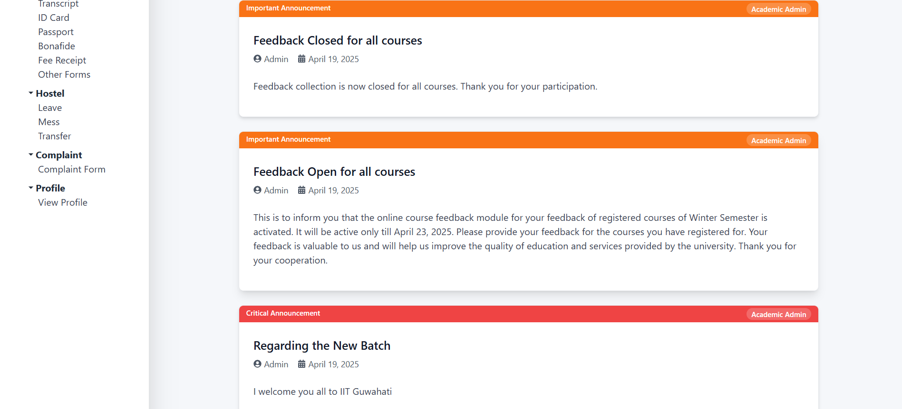
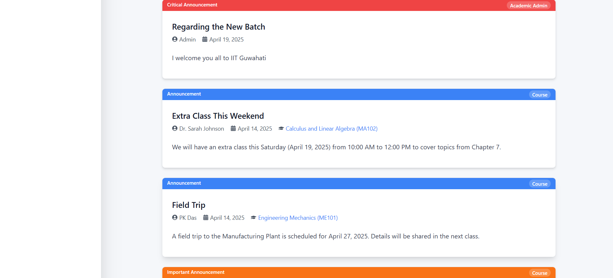

<DOCUMENT filename="announcementsPage.md">
# Announcements Module - User Guide

## 1. Overview

This page allows you to view all announcements from your courses and academic administration. It provides a centralized interface to stay updated with the latest information.

---

## 2. Page Layout

When you navigate to the **Announcements** page under the Course section, you will see the following key sections:

- **Title:** Displays the heading "All Announcements" at the top.
- **Sidebar Menu:** Options include Course Registration, Active Courses, Assignment, Attendance, Time Table, Drop Course, Fee Payment, Library Fee, Document (All Documents, Transcript, ID Card, Passport, Bonafide, Fee Receipt, Other Forms), Hostel (Leave, Mess), Transfer, Complaint (Complaint Form), and Profile (View Profile).
- **Search and Filters:** Includes a search bar and dropdowns for Type (All Types, Course Announcements, Admin Announcements) and Importance (All Importance Levels, Critical, High, Medium, Low).
- **Announcement Cards:** Displays the total number of announcements and categorized counts (Course Announcements, Admin Announcements).
- **Announcement Details:** Each announcement card shows the title, date, and content, with filters applied based on type and importance.
- **Logout Button:** Located at the top right for user logout.

---

## 3. Features and How to Use Them

### 3.1 Viewing Announcements

- **Search Bar:** Enter keywords to search for specific announcements (e.g., "feedback").
- **Type Filter:** Select from "All Types," "Course Announcements," or "Admin Announcements" to filter announcements by source.
- **Importance Filter:** Select from "All Importance Levels," "Critical," "High," "Medium," or "Low" to filter by priority.
- **Announcement Cards:**
  - **Total Announcements:** Shows the total number (e.g., 12).
  - **Course Announcements:** Shows the count (e.g., 9).
  - **Admin Announcements:** Shows the count (e.g., 3).
- **Example Announcements:**
  - **Feedback Closed for all courses:** Important announcement from Admin on April 19, 2025.
  - **Feedback Open for all courses:** Important announcement from Admin on April 19, 2025.
  - **Regarding the New Batch:** Critical announcement from Admin on April 19, 2025.

---

## 4. Validation and Behavior

- **Search Functionality:** Returns relevant announcements based on keywords.
- **Filter Consistency:** Applies selected type and importance filters instantly to the announcement list.
- **Empty Results:** Displays a message if no announcements match the search or filter criteria.

---

## 5. Important Notes

- **Regular Checks:** Stay updated by checking announcements regularly.
- **Filter Usage:** Use filters to prioritize critical or course-specific information.
- **Contact:** For issues or questions, reach out to the academic administration or course instructors.

---

</DOCUMENT>