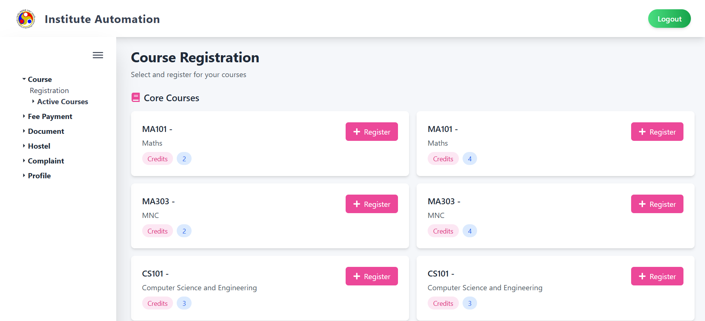
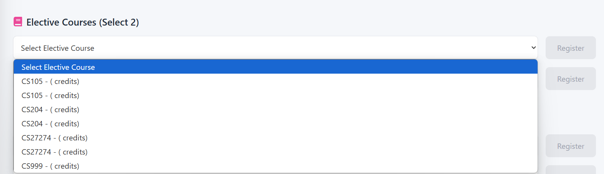
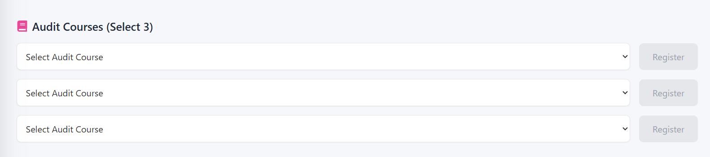

# Course Registration Module

## 1. Overview

This module allows students to register for various types of courses including **Compulsory**,**Audit**, and **Elective** courses. The interface provides a categorized view and lets you track your registration status. You can easily add/drop courses, view course details, and stay updated on your course selections.

---

## 2. Page Layout

The registration interface is divided into **tabs** based on course types:

- **Compulsory Courses**
- **Elective Courses**
- **Audit Courses**

Each tab displays a categorized list of courses with options to register/unregister, view course details, and track status.

---

## 3. Detailed Course Tabs and Usage

### 3.1 Compulsory Courses

Compulsory courses are **automatically assigned** based on your curriculum and semester.

- You will see a table with:
  - **Course Code**
  - **Course Name**
  - **Credits**
  - **Type**: Always shows `Compulsory`
  - **Status**: Indicates your registration state

📌 **Usage**:  
You **do not need to manually register** for compulsory courses. They are pre-registered by the system. The **Status** will show:
- ✅ `Registered` – You are enrolled in this course.
- ❌ `Dropped` – You have opted out (if allowed).
- 🔄 `Pending` – Registration is yet to be processed.

---

### 3.2 Elective Courses

Elective courses offer flexibility to choose based on interest or academic plan.

- Displayed in a table with:
  - **Course Code**
  - **Course Name**
  - **Credits**
  - **Type**: Shows `Elective`
  - **Action Button**: `Register` or `Drop`
  - **Status**

📌 **Usage**:
- Click **Register** to opt in for an elective.
- Once registered, the button changes to **Drop**, allowing you to cancel the registration.
- You may be limited in the number of electives you can take.
- **Status** shows your current enrollment state.

---

### 3.3 Audit Courses

Audit courses are **non-credit** courses taken for learning without grade impact.

- Displayed under the **Audit** tab
- Shows:
  - **Course Code**, **Course Title**, **Audit Label**
  - Register/Drop buttons
  - **Credits** may be displayed as `0` or `Audit`
  - **Status** indicator

📌 **Usage**:
- Click **Register** to add the course as an audit.
- Use **Drop** if you no longer wish to audit the course.
- No grade will be assigned and it won’t affect GPA.

🛈 **Note**: Some institutes require approval to audit certain courses.

---

## 4. Registration Status

Each course row has a **Status** column, which reflects your registration progress:

- ✅ **Registered**: You are enrolled successfully.
- ⏳ **Pending**: Registration request has been submitted but not confirmed.
- ❌ **Dropped**: You have opted out or removed the course.
- ⚠️ **Closed**: Course registration is closed (due to deadline or seat limits).

---

## 5. Validation and Rules

- 🈚 **Empty Registration Prevention**: You cannot register without selecting a course.
- 🎓 **Limits**: Credit-based or category-based limits may apply (e.g., max 2 electives).
- ⛔ **Drop Restrictions**: Courses may not be dropped after a deadline.
- 🔐 **Role-Based Access**: Only students can perform registration actions.

---

## 6. Best Practices

- 🕒 **Register Early**: Electives may have limited seats.
- 📅 **Track Deadlines**: Dropping after deadlines may not be allowed.
- ✅ **Verify Status**: Always double-check the **Status** column to ensure successful registration.
- 🧾 **Download Confirmation** (if available): Some systems allow downloading a registration slip.

---

## 7. Troubleshooting / FAQ

**Q1: I clicked "Register" but the course still shows "Pending." What does that mean?**  
🛈 It means your request is awaiting backend confirmation. Check back shortly or contact admin if it persists.

**Q2: I dropped a course by mistake. Can I re-register?**  
✅ Yes, as long as the deadline hasn’t passed and seats are available.

**Q3: Why can't I see some courses in my elective list?**  
🎯 Electives are shown based on your program/semester. Not all electives are open every term.

**Q4: I see "Closed" status on a course. What now?**  
🛑 That course has reached its registration deadline or seat limit. Try choosing an alternative.

---

## 8. Contact

For issues related to course registration, reach out to your:

- 🎓 **Academic Advisor**
- 📩 **Course Coordinator**
- 🛠️ **Technical Support Team**

---
