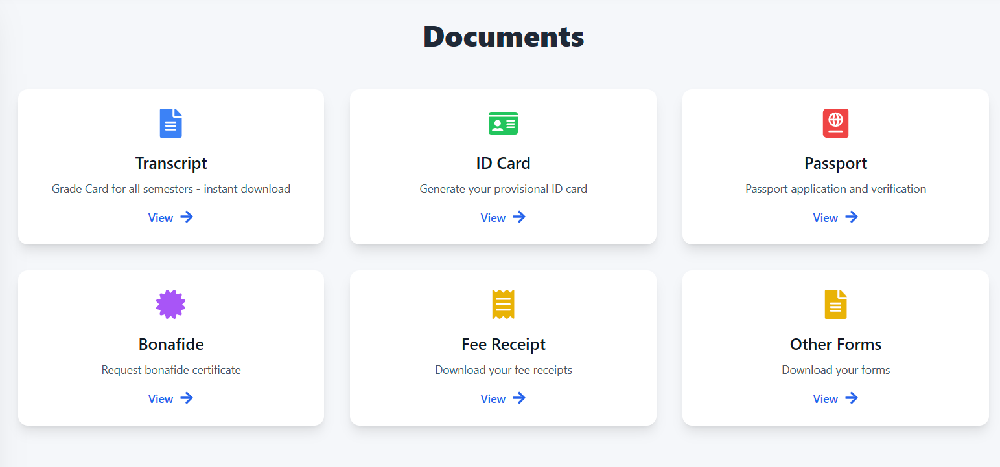

## Documents_Page

This page provides access to important academic documents that you may need during your time as a student.

**Purpose:**

The Documents page serves as a centralized hub to easily download, generate, and request various essential documents. This eliminates the need to visit different departments or offices to obtain the required paperwork.

---
**Available Documents:**

The following documents are accessible on this page:

1.  **Transcript:**
    *   **Description:**  Your official academic record, including all grades received for all semesters.
    *   **Functionality:**  Instant download available. You can download the transcript in a digital format (e.g., PDF)
    *   **How to Use:** Click the "View →" button below the Transcript description.  The transcript will download automatically.

2.  **ID Card:**
    *   **Description:** Allows you to generate your provisional college ID card.
    *   **Functionality:**  Enables you to create a digital ID card.
    *   **How to Use:** Click the "View →" button below the ID Card description. You will likely be redirected to a form or a page where you need to input required information (e.g., student ID, personal details, photo) to generate your ID.

3.  **Passport:**
    *   **Description:** Information about Passport application and verification.
    *   **Functionality:** Provides instruction about passport application.
    *   **How to Use:** Click the "View →" button below the Passport description. You will be redirected to a page with more details, instructions, or a link to begin passport application.

4.  **Bonafide:**
    *   **Description:** Enables you to request a Bonafide certificate.
    *   **Functionality:** This certificate verifies that you are currently enrolled at the institution.
    *   **How to Use:** Click the "View →" button below the Bonafide description. You will be redirected to a form or a page where you can fill out the request for your Bonafide certificate. Follow the instructions provided to complete your request.

5.  **Fee Receipt:**
    *   **Description:** Provides access to download your fee receipts for paid tuition or other fees.
    *   **Functionality:** Enables you to access and save your payment records.
    *   **How to Use:** Click the "View →" button below the Fee Receipt description.  A list of available fee receipts will be shown or the latest receipt will download.  If a list is displayed, select the specific receipt you wish to download.

6.  **Other Forms:**
    *   **Description:** A central location for downloading various other forms related to your academic career.
    *   **Functionality:** Access to additional documents or templates required for specific processes.
    *   **How to Use:** Click the "View →" button below the Other Forms description. You will be redirected to a list of available forms that you can download. Select the form you need and click the download link.

---
**General Instructions:**

*   To access any of the listed documents or initiate any process, simply click the "View →" button associated with each document description.
*   The system will redirect you to a specific page related to the document.
*   Follow the on-screen instructions to complete the process, download the file, fill the forms, or submit a request.

---
**Important Note:**

*   Document availability and specific processes may vary.
*   Always check the official website or contact the relevant departments for the most up-to-date information.
*   This documentation may be updated periodically. Please refer to the "Last Updated" date at the bottom of this document.

---
