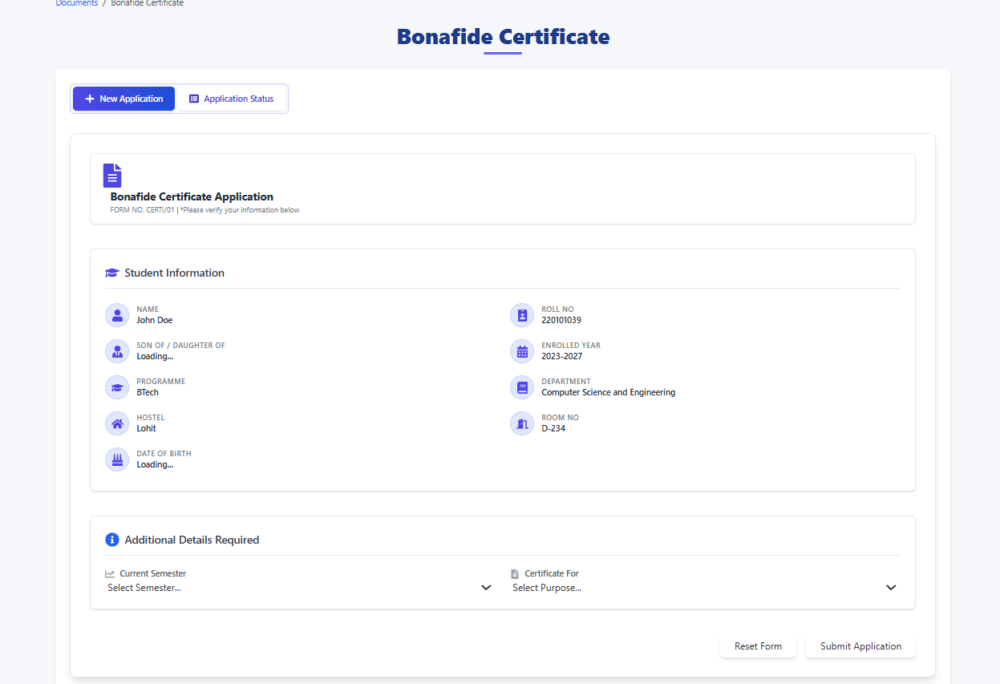

# Bonafide Certificate Application

This page allows you to apply for a Bonafide Certificate.

## Navigation

To reach this page:

1.  Navigate to the **All Documents** page.
2.  Locate the **Bonafide** card.
3.  Click the **View ->** link on the Bonafide card.

## Page Layout

The page is titled **Bonafide Certificate**. It contains the following sections:

1.  **Tabs:**
    * **+ New Application:** This is the default active tab, displaying the application form.
    * **Application Status:** Click this tab to check the status of previously submitted applications (details for this tab would require a separate screenshot/documentation).

2.  **Bonafide Certificate Application Form:**
    * **Student Information:** This section displays your pre-filled information, such as:
        * Student Name
        * Roll Number
        * Program Name (e.g., Computer Science and Engineering)
        * Department
        * Batch (e.g., 2024)
        * Hostel
        * Room No.
        * DOB
        

    * **Additional Details Required:** This section requires your input to complete the application:
        * **Current Semester:** A dropdown menu to select your current semester (from 1 to 8).
        * **Certificate For:** A dropdown menu to select the purpose for which you require the Bonafide Certificate,such as:
        * Bank Account opening 
        * Educational Loan
        * passport appilication
        * Visa appilication
        * Scholarship Appilication.

3.  **Action Buttons:**
    * **Reset Form:** Clears any selections you have made in the "Additional Details Required" section, allowing you to start over.
    * **Submit Application:** Submits your application for the Bonafide Certificate after you have filled in the required details.

## How to Apply

1.  Verify your details in the **Student Information** section.
2.  In the **Additional Details Required** section:
    * Select your **Current Semester** from the dropdown list.
    * Select the **Certificate For** (purpose) from the dropdown list.
3.  Review your selections.
4.  Click the **Submit Application** button.
5.  (Optional) If you need to clear your selections, click the **Reset Form** button.

---

