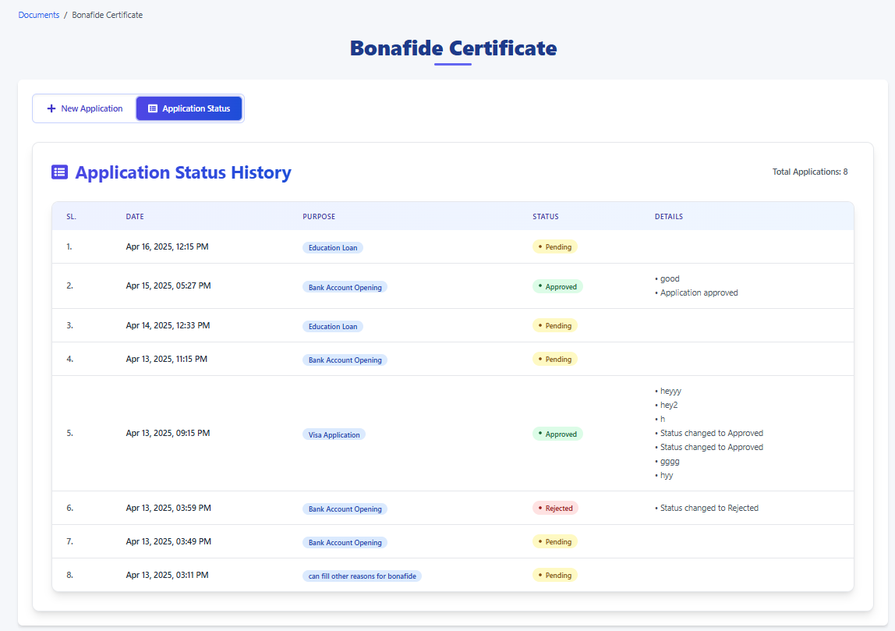

## Bonafide Certificate - Application Status History

---

### 1. Overview

This page provides a comprehensive history of all Bonafide Certificate applications you have submitted through this portal. It allows you to track the progress of pending applications, review the outcomes of completed ones (Approved or Rejected), and see the details associated with each application.

---

### 2. Accessing the Page

You can typically access this page by navigating through the portal's menu system (e.g., `Documents / Bonafide Certificate`) and then clicking on the **`Application Status`** button.

---

### 3. Page Elements

Here's a breakdown of the key components on this page:

*   **Breadcrumbs:** (e.g., `Documents / Bonafide Certificate`) Shows your current location within the portal.
*   **Page Title:** `Bonafide Certificate` - The main title for this section of the portal.
*   **Action Buttons:**
    *   `+ New Application`: Click this button to start the process of applying for a *new* Bonafide Certificate.
    *   `Application Status`: Click this button (or it will be highlighted if you are already on the page) to view this history list.
*   **Section Title:** `Application Status History` - Clearly indicates the purpose of the main table below.
*   **Total Applications:** (Located top-right of the history table) Shows the total count of applications you have submitted.
*   **Application History Table:** This table lists all your applications with the following columns:
    *   **`SL.` (Serial Number):** A unique number assigned to each application entry in this list for easy reference.
    *   **`DATE`:** The date and time when the application was submitted or potentially last updated.
    *   **`PURPOSE`:** The reason you specified for needing the Bonafide Certificate (e.g., `Education Loan`, `Bank Account Opening`, `Visa Application`, or a custom reason).
    *   **`STATUS`:** The current processing state of your application. Common statuses include:
        *   `Pending` (Yellow): The application has been submitted but is awaiting review or processing by the administration.
        *   `Approved` (Green): The application has been reviewed and the Bonafide Certificate request has been granted.
        *   `Rejected` (Red): The application has been reviewed and denied. Check the 'Details' column for reasons.
    *   **`DETAILS`:** Provides additional information or remarks related to the application status. This may include:
        *   Reasons for rejection.
        *   Confirmation notes upon approval.
        *   Any other comments added by the administrator processing the request.
        *   It might be blank if no specific details were added.

---

### 4. How to Use This Page

1.  **Check Application Progress:** Locate the application you are interested in (usually the most recent one will be at the top or bottom depending on sorting). Check the `STATUS` column to see if it's `Pending`, `Approved`, or `Rejected`.
2.  **Understand Outcomes:**
    *   If `Approved`, your certificate should be ready or instructions on how to obtain it might be available elsewhere or communicated separately.
    *   If `Rejected`, carefully read the information in the `DETAILS` column to understand why. You may need to re-apply with corrections or contact the relevant office/administrator.
    *   If `Pending`, please wait for the administration to process your request. Processing times may vary.
3.  **Review Past Applications:** Use this page as a record of all your previous Bonafide Certificate requests and their outcomes.
4.  **Start a New Request:** If you need another Bonafide Certificate for a different purpose, click the `+ New Application` button.

---

### 5. Important Notes

*   The list is typically sorted by date, often with the most recent application appearing first (as shown in the example).
*   If you have questions about a specific application's status, particularly if it has been `Pending` for a long time or if the `DETAILS` for a `Rejected` application are unclear, contact the relevant administrative office or support channel for your institution/organization.

---