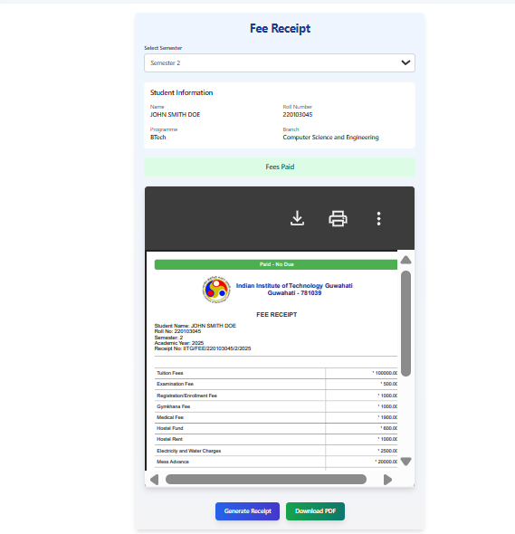
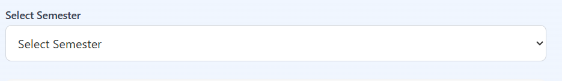
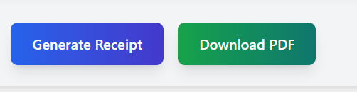

## Fee_Receipt_Page

**1. Overview**

This page allows you to generate and download your academic fee receipt for a specific semester. You can select the desired semester, view your basic student information, see the payment status for that semester based on records, preview the receipt, and download it as a PDF file.

---

**2. Page Sections**

The page is organized into the following sections:

*   **Title:** "Fee Receipt" clearly identifies the page's purpose.
*   **Semester Selection:**
    *   A dropdown menu labeled "Select Semester".
    *   **Purpose:** Allows you to choose the specific academic semester (e.g., Semester 1, Semester 2, etc.) for which you want to generate the fee receipt.
*   **Student Information:**
    *   Displays your key details:
        *   Name
        *   Roll Number
        *   Programme (e.g., BTech)
        *   Branch (e.g., Computer Science and Engineering)
    *   **Purpose:** Helps you confirm that the page is showing information relevant to you.
*   **Fee Payment Status (Conditional):**
    *   This section appears *only after* you select a semester from the dropdown.
    *   It displays a clear message indicating whether the fees for the *selected semester* are recorded as "**Fees Paid**" (typically shown with a green background) or "**Fees Not Paid**" (typically shown with a red background).
    *   **Purpose:** Informs you about the recorded payment status for the chosen semester before you generate the receipt. Note: This status is based on existing records and cannot be changed on this page.
*   **PDF Preview Area:**
    *   A designated area where a preview of the generated fee receipt PDF will be displayed.
    *   If a receipt is being generated, it might show a loading indicator.
    *   **Purpose:** Allows you to see the content and layout of the fee receipt before downloading it.
*   **Action Buttons:**
    *   **Generate Receipt Button:**
        *   Used to initiate the creation of the fee receipt PDF for the selected semester.
        *   This button is disabled until you select a semester. It will also show "Generating..." and be disabled while the PDF is being created.
    *   **Download PDF Button (Conditional):**
        *   This button appears *only after* you have successfully generated a receipt using the "Generate Receipt" button.
        *   **Purpose:** Allows you to save the generated fee receipt PDF to your device.

--- 

**3. How to Use the Page**

Follow these steps to generate and download your fee receipt:

1.  **Select Semester:**
    *   Click on the dropdown menu labeled "Select Semester".
    *   Choose the specific semester for which you need the receipt (e.g., "Semester 4").
    *   Once selected, the **Fee Payment Status** message will appear below the Student Information, indicating if fees are marked as paid or not paid for that semester.

2.  **Generate the Receipt:**
    *   Click the "**Generate Receipt**" button.
    *   The button text will change to "Generating...", and it will become temporarily disabled.
    *   The **PDF Preview Area** will likely show a loading indicator.
    *   Wait a few moments for the system to create the PDF.
    *   Once generated, a preview of the fee receipt will appear in the **PDF Preview Area**.
    *   The "**Download PDF**" button will now become visible next to the "Generate Receipt" button.

3.  **Preview the Receipt (Optional):**
    *   Scroll through the preview in the **PDF Preview Area** to check the details (student info, fee breakdown, payment status indication, semester).

4.  **Download the Receipt:**
    *   Click the "**Download PDF**" button.
    *   Your browser will prompt you to save the file, or it will automatically download the PDF.
    *   The downloaded file will typically be named something like `Fee_Receipt_Sem_[SemesterNumber].pdf` (e.g., `Fee_Receipt_Sem_4.pdf`).
    *   Save the file to a location where you can easily find it.

---
**4. Important Notes & Troubleshooting**

*   **Semester Selection Required:** You *must* select a semester before you can generate a receipt.
*   **Payment Status:** The "Fees Paid" / "Fees Not Paid" status displayed is based on the information recorded in the system for the selected semester. This page *does not* process payments; it only generates receipts based on existing data.
*   **Receipt Content:** The fee breakdown shown in the generated receipt might be standard for the selected academic session or specific to your record, depending on how the system is configured.
*   **PDF Viewer:** You need a PDF viewer application (like Adobe Acrobat Reader or a built-in browser viewer) to open and view the downloaded receipt file.
*   **Generation Time:** PDF generation might take a few seconds, especially for complex documents. Please be patient.
*   **Troubleshooting:**
    *   If the "Generate Receipt" button remains disabled, ensure you have selected a semester from the dropdown.
    *   If the PDF preview doesn't load or the download fails, try refreshing the page and repeating the steps. Ensure you have a stable internet connection.
    *   If issues persist, contact the relevant administrative or technical support department.
---