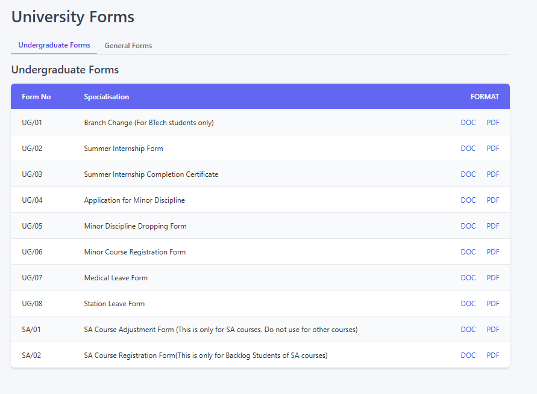
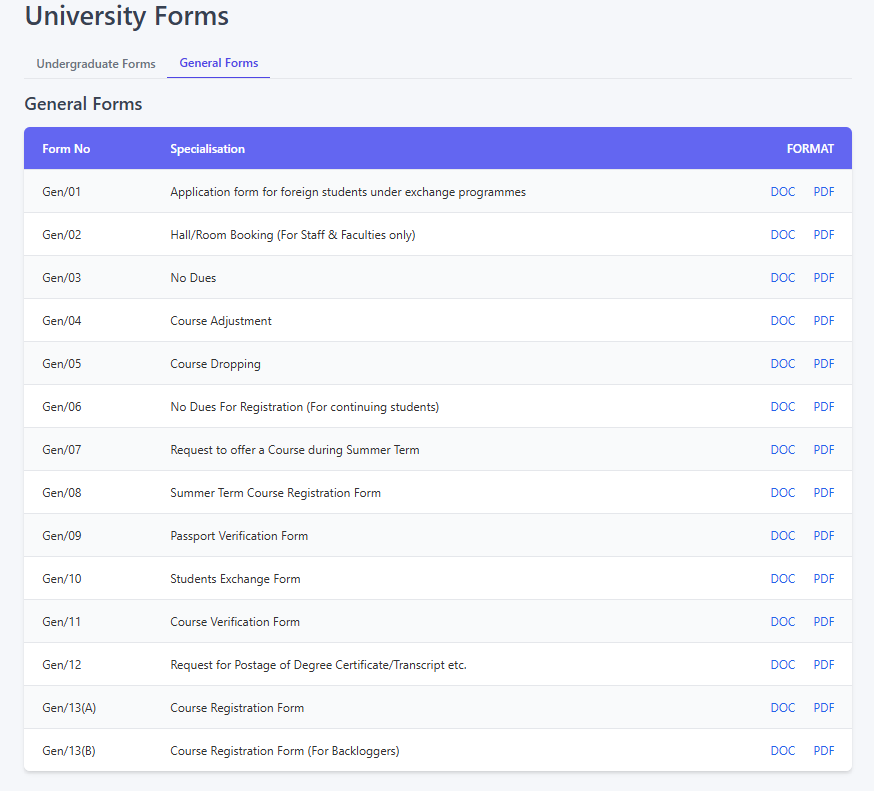

## University Forms Page

---

### 1. Overview

The University Forms page serves as a central repository for various official forms used within the university. It provides easy access to downloadable forms categorized into relevant sections for students and potentially staff/faculty.

---

### 2. Accessing the Page

This page can typically be accessed through the main university portal navigation, often found under a section like 'Forms', 'Downloads', 'Student Services', or 'Academics'.

---

### 3. Page Layout and Features

The page is organized for clarity and ease of use:

*   **Page Title:** `University Forms` - Indicates the content of the page.
*   **Tabs:** The forms are divided into logical categories using tabs:
    *   **`Undergraduate Forms`:** This tab lists forms specifically relevant to undergraduate students. Examples include forms for branch changes, internships, minor disciplines, leave requests, and specific course adjustments (like SA courses).
    *   **`General Forms`:** This tab contains forms that may apply more broadly to various students (undergraduate or postgraduate), staff, or general administrative processes. Examples include forms for foreign exchange students, hall/room booking, no dues certificates, general course adjustments/dropping, summer term requests, verification forms, and degree/transcript requests.
*   **Forms Table:** Within each tab, the forms are presented in a table format with the following columns:
    *   **`Form No`:** A unique identification code assigned to each form (e.g., `UG/01`, `Gen/02`, `SA/01`). This helps in quickly referencing specific forms.
    *   **`Specialisation`:** Provides a description or the official title of the form, explaining its purpose. This column may also contain important notes or restrictions on who should use the form (e.g., "For BTech students only", "This is only for SA courses", "For Staff & Faculties only", "For Backlog Students").
    *   **`FORMAT`:** This column contains links to download the form in different file formats.

---

### 4. Understanding and Using the Format Links (DOC / PDF)

The `FORMAT` column provides links to access the forms:

*   **`DOC` Link:**
    *   **Action:** Clicking the `DOC` link will typically **initiate a download** of the form in a Microsoft Word document format (`.doc` or `.docx`).
    *   **Purpose:** This format is often provided when the form needs to be **edited or filled out electronically** before printing. You will need Microsoft Word or a compatible word processing software (like Google Docs, LibreOffice Writer) to open and edit these files.
*   **`PDF` Link:**
    *   **Action:** Clicking the `PDF` link will usually **open the form directly in your web browser's built-in PDF viewer** or prompt you to download the file, depending on your browser's settings.
    *   **Purpose:** The PDF (Portable Document Format) version is primarily intended for **viewing and printing** while preserving the exact layout and formatting. Some PDFs might be "fillable," allowing you to type directly into fields using a suitable PDF reader (like Adobe Acrobat Reader), but they are generally less flexible for editing than DOC files.

---

### 5. How to Use This Page

1.  Navigate to the `University Forms` page.
2.  Click on the relevant tab (`Undergraduate Forms` or `General Forms`) depending on the type of form you need.
3.  Scan the list using the `Form No` and `Specialisation` columns to find the specific form you require. Pay attention to any notes in the `Specialisation` column regarding eligibility or specific use cases.
4.  Decide which format you need:
    *   If you want to **fill out the form electronically** on your computer before printing, click the **`DOC`** link to download the Word document.
    *   If you want to **view the form immediately** or print a blank copy to fill out by hand, click the **`PDF`** link.
5.  Open the downloaded (DOC) or viewed/downloaded (PDF) file using the appropriate software.

---

### 6. Important Notes

*   Ensure you have the necessary software installed to open the files (a word processor for DOC, a PDF reader for PDF). Adobe Acrobat Reader is a common free PDF viewer.
*   Always read the form instructions carefully before filling it out.
*   If you are unsure which form to use or cannot find the form you need, please contact the relevant university department (e.g., Academic Office, Dean's Office, Hostel Office) for assistance.

---