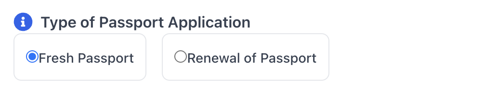

# Passport Certificate Application - User Guide

## 1. Overview

This page allows you to apply for a Passport from the institution. You can also track the status and history of your submitted applications here.

## 2. Page Layout

When you navigate to the Passport Application page, you will see the following main areas:

*   **Title:** The page is titled "Passport Application".
*   **Tabs:** Two main tabs allow you to switch between views:
    *   **New Application:** This tab displays the form to submit a new request for a Passport Certificate.
    *   **Application Status:** This tab shows a history of all the Passport Certificate applications you have previously submitted.
*   **Content Area:** Depending on the selected tab, this area will show either the application form or the status history table.
*   **Loading/Error States:** If the system is fetching your initial student data, you might briefly see a loading indicator. If there's an error fetching essential data, an error message may be displayed.

## 3. Features and How to Use Them

### 3.1 Switching Views

*   Click the **"New Application"** tab button to access the form for submitting a request.
*   Click the **"Application Status"** tab button to view the history and current status of your past applications.

### 3.2 Applying for a Passport Certificate (New Application Tab)

This section guides you through filling out the application form.

1.  **Review Student Information:**
    *   Your basic details (Name, Roll No, Programme, Department, Date of Birth, Contact Info, Parent's Names, Hostel Details) are automatically fetched and displayed.
    *   **Action:** Carefully review this information. If any details are incorrect, please contact the relevant administrative office (e.g., Academic Section, Student Records) *before* submitting the application, as this information will likely be used on the certificate.

2.  **Fill Additional Details:**
    *   **Application Type:** Select either "Fresh Passport" or "Renewal of Passport" based on your requirement.

    
    *   **Current Semester:** Select your current academic semester from the dropdown list.
    *   **Place of Birth:** Enter your place of birth exactly as it appears on your official documents (like your birth certificate or previous passport).
    *   **Mode of Application:**
        *   Choose "Normal" for standard processing.
        *   Choose "Tatkal" if you require expedited processing.
        *   **If Tatkal:** A "Reason for Tatkal" text box will appear. You **must** provide a clear justification for the urgent request. *Note: You may be required to submit supporting documents separately as per institutional policy.*
    *   **Travel Plans:**
        *   Indicate if you have definite travel plans within the next 2 months ("Yes" or "No").
        *   **If Yes:** Additional fields will appear:
            *   **Place and Purpose of Visit:** Briefly describe where you are going and why (e.g., "USA for Summer Internship Program").
            *   **From Date:** Select the start date of your planned travel.
            *   **To Date:** Select the end date of your planned travel. Ensure the 'To Date' is after the 'From Date'.
    
3.  **Validation:**
    *   The form requires certain fields to be filled (like Place of Birth, Semester).
    *   Conditional fields (Tatkal Reason, Travel Details/Dates) become required based on your selections.
    *   If you miss a required field or enter invalid data (e.g., 'To Date' before 'From Date'), an error message will appear below the respective field after you try to submit.

4.  **Resetting the Form:**
    *   Click the **"Reset Form"** button if you want to clear all the fields you've entered and start over.

5.  **Submitting the Application:**
    *   Once you have filled all necessary details correctly, click the **"Submit Application"** button.
    *   The system will validate the form again.
    *   If successful, your application will be submitted, you'll see a success message (e.g., "Passport application submitted successfully"), and you will automatically be taken to the "Application Status" tab.
    *   If there's an error during submission, an error message will be displayed.

### 3.3 Checking Application Status (Application Status Tab)

This section displays a table listing all your submitted Passport Certificate applications.

*   **Information Displayed:** For each application, the table shows:
    *   **Sl.:** Serial number.
    *   **Date:** The date you submitted the application.
    *   **Application Type:** Fresh or Renewal.
    *   **Mode:** Normal or Tatkal.
    *   **Remarks:** Any comments or notes added by the administration regarding your application.
    *   **Status:** The current processing stage of your application (e.g., `Pending`, `Under Review`, `Approved`, `Rejected`, `Ready for Collection`). Statuses are often color-coded for quick identification.
*   **No Applications:** If you haven't submitted any applications yet, a message indicating "No passport applications found" will be displayed.
*   **Action:** Regularly check this tab to monitor the progress of your submitted applications.

---

## 4. Important Notes

*   **Data Accuracy:** Ensure all your pre-filled student information is correct *before* applying. Errors in this data will reflect on the certificate. Contact administration for corrections if needed.
*   **Tatkal Processing:** Selecting "Tatkal" requires justification. Be prepared to provide supporting evidence for urgency if requested by the administration, even if not uploaded via the form. Tatkal processing may also involve different procedures or fees as per institutional rules.
*   **Processing Time:** Applications take time to process. The status will be updated in the "Application Status" tab as it moves through the administrative workflow.
*   **Collection:** Once the status shows as "Approved" or "Ready for Collection", follow the institutional procedure for collecting the physical certificate (if applicable). Check for any remarks regarding collection.
*   **Contact:** For specific questions about your application status or required procedures not covered here, contact the designated administrative office (e.g., Academic Section, Dean of Student Affairs Office).