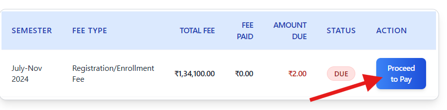

## Fee_Payment_Page

**1. Overview**

This page allows you to view your current academic fee status, pay any outstanding fees for the specified semester, and download payment receipts for successful transactions. The payment process is handled securely through the Razorpay payment gateway.

---
**2. Page Sections**

When you load the page, you will see several sections:

*   **Page Title:** "Academic Fee Payment" clearly indicates the page's purpose.
*   **Student Identification:**
    *   Displays your profile photo, name, roll number, programme (e.g., B.Tech), branch (e.g., Computer Science & Engineering), and the current semester for which the fee is applicable (e.g., July-Nov 2024).
    *   **Purpose:** Verify that the fee details displayed belong to you and the correct academic term.
*   **Fee Overview:**
    *   A summary table showing the semester, fee type (e.g., Registration/Enrollment Fee), Total Fee amount, Fee Paid amount, Amount Due, and the current Payment Status (e.g., "Due" or "Paid").
    *   **Action Button:**
        *   If fees are **Due**, a "**Proceed to Pay**" button will be visible.
        *   If fees are **Paid**, a "**✓ Payment Complete**" message will be displayed instead of the button.
    *   **Purpose:** Provides a quick glance at your fee obligation and the primary action required.
*   **Fee Breakdown:**
    *   A detailed table listing all the individual components that make up the total fee (e.g., Tuition Fees, Hostel Rent, Medical Fee, etc.) along with their respective amounts.
    *   It also shows the Total Amount, any Adjustment Amount, and the final **Net Payable Amount**.
    *   **Purpose:** Provides transparency on how the total fee amount is calculated.
*   **Payment Confirmation (Appears *after* successful payment):**
    *   This section only becomes visible once you have successfully completed a payment transaction via this page.
    *   It displays a table with details of your successful payment, including:
        *   Serial Number (Sl. No.)
        *   Fee Type Paid
        *   Amount Paid
        *   Transaction ID (from Razorpay)
        *   Date & Time of the transaction
        *   Status (e.g., "Success")
    *   **Action Button:** A "**Download Receipt**" button is provided in this section.
    *   **Purpose:** Confirms your payment details and allows you to download proof of payment.

---
**3. How to Use the Page**

*   **Checking Your Fee Status:**
    1.  Navigate to the Academic Fee Payment page.
    2.  The page will briefly show a "Loading Fee Details..." message.
    3.  The "Status" column will show either "**Due**" (in red) or "**Paid**" (in green).
    4.  The "Amount Due" column will show the remaining amount to be paid (if any).

*   **Paying Your Fees (If Status is "Due"):**

    

    1.  Locate the "**Proceed to Pay**" button in the "Action" column.
    2.  Click the "**Proceed to Pay**" button. The button might briefly change to "Processing...".

    

    3.  A secure **Razorpay payment popup** will appear over the page.
        *   *Note: Ensure pop-ups are not blocked by your browser for this site.*
    4.  The popup will show the amount to be paid and various payment options (Credit/Debit Card, Net Banking, UPI, Wallets, etc.). Your name, email, and contact number may be pre-filled if available in your student record.
    5.  Select your preferred payment method and follow the on-screen instructions within the Razorpay popup to complete the payment securely.
    6.  **Upon Successful Payment:**
        *   The Razorpay popup will show a success message and close automatically.
        *   The page will refresh or update.
        *   The "Status" in the **Fee Overview** section will change to "**Paid**".
        *   The "Amount Due" will become ₹ 0.00.
        *   The "**Proceed to Pay**" button will be replaced with "**✓ Payment Complete**".
        *   The **Payment Confirmation** section will appear below the Fee Breakdown, showing your transaction details.
    7.  **If Payment Fails or is Cancelled:**
        *   The Razorpay popup will indicate the failure or you might close it manually.
        *   An alert message might appear on the page indicating the failure.
        *   The page status will remain "**Due**".
        *   You can click "**Proceed to Pay**" again to retry the payment.

*   **Downloading Your Fee Receipt (After Successful Payment):**
    1.  Ensure your fee status is "Paid" and the **Payment Confirmation** section is visible.
    2.  Locate the "**Download Receipt**" button in the "Action" column of the **Payment Confirmation** table.
    3.  Click the button. It might briefly change to "Generating...".
    4.  A PDF file containing your official fee receipt will be automatically downloaded to your device. The filename will typically be like `Fee_Receipt_[YourRollNumber]_Sem[SemesterName].pdf`.
    5.  Open the downloaded PDF file to view or print your receipt.

---
**4. Important Notes & Troubleshooting**

*   **Internet Connection:** A stable internet connection is required for the payment process to work correctly.
*   **Pop-up Blockers:** Ensure your browser is not blocking pop-ups for this website, as the Razorpay payment interface appears in a pop-up window.
*   **Payment Issues:** If a payment fails repeatedly, double-check your payment details (card number, expiry, CVV, UPI ID, etc.), ensure sufficient funds/limit, and try an alternative payment method. If problems persist, contact the relevant administrative or support department.
*   **Receipt Download Issues:** If the receipt fails to download, try clicking the "Download Receipt" button again. Ensure you have a PDF viewer installed. If the issue continues, contact support.
*   **Accuracy:** Always verify the student details and semester shown on the page before proceeding with payment.
*   **Payment Gateway:** Payments are processed securely via Razorpay. The institution does not store your sensitive card or bank details.

---