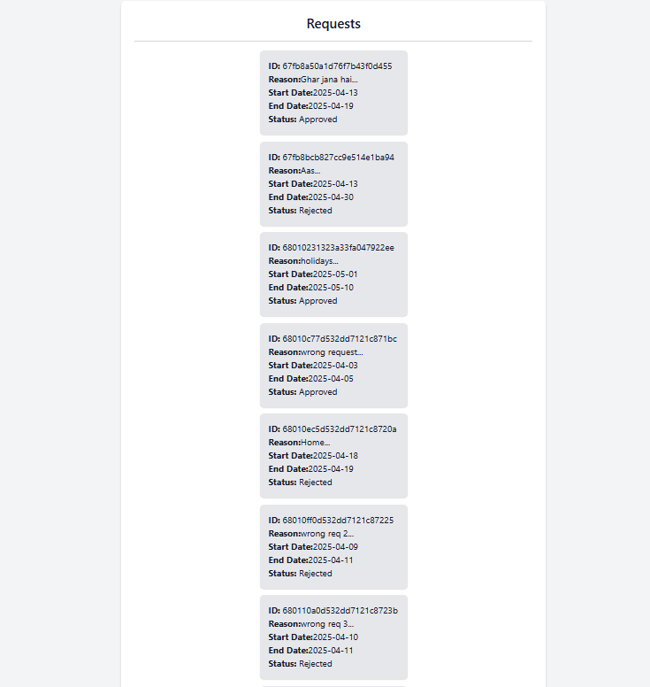
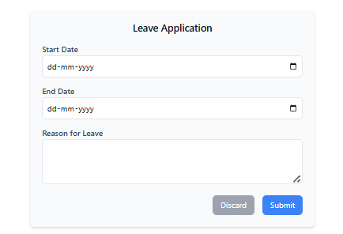

# Hostel Leave Management System

## 1. Overview

The Hostel Leave Management system allows you to request temporary leaves from the hostel. You can submit new leave applications with date ranges and reasons, and track the status of your requests as they are reviewed by hostel administrators.

---

## 2. Page Sections

The student interface contains the following sections:

### 2.1 Title Section

- **Header:** "Requests" clearly identifies the page's purpose.

### 2.2 Request Display Area

- Shows all your previous leave requests in a list format.
- **Purpose:** Provides a comprehensive view of all your leave applications and their current status.

### 2.3 Leave Application Button

- Located at the bottom of the page.
- **Purpose:** Opens the form to submit a new leave request.

### 2.4 Leave Application Form (Conditional)

- This section appears _only when_ you click the "Apply for Leave" button.
- **Purpose:** Allows you to submit a new leave request by specifying dates and providing a reason.

---

## 3. How to Use the Page

### 3.1 View Existing Requests

- When you first access the page, you'll see a list of all your previous leave requests.
- Each request card displays:
  - Request ID
  - A snippet of your reason
  - Start date
  - End date
  - Current status (Pending, Approved, or Rejected)

### 3.2 View Complete Reason

- Click on any request card to open a popup displaying the complete reason for your leave request.
- Click "Close" to dismiss the popup and return to the main view.

### 3.3 Apply for Leave

- Click the "Apply for Leave" button at the bottom of the page.
- Fill out the required information in the form:
  - **Start Date:** The first day of your intended leave
  - **End Date:** The last day of your intended leave (must be after start date)
  - **Reason for Leave:** Detailed explanation for your leave request
- Click "Submit" to send your request or "Discard" to cancel.

### 3.4 Track Request Status

- After submission, your request will appear in the list with a "Pending" status.
- Status will update to "Approved" or "Rejected" once an administrator reviews your request.

---

## 4. Understanding Request Cards

Each request card in your list contains the following information:

- **ID:** Unique identifier for your leave request
- **Reason:** First few words of your reason (click to view the full text)
- **Start Date:** First day of your requested leave period (in YYYY-MM-DD format)
- **End Date:** Last day of your requested leave period (in YYYY-MM-DD format)
- **Status:** Current state of your request (Pending, Approved, or Rejected)

---

## 5. Important Notes & Troubleshooting

- **Date Validation:** The system prevents you from selecting an end date that's before or the same as the start date.
- **Empty State:** If you have no leave requests, the message "No pending requests" will be displayed.
- **Loading State:** While fetching your requests, a "Loading..." message will be shown.
- **Multiple Requests:** You can submit multiple leave requests simultaneously if needed.
- **Submit Button Disabled:** If your end date is before or the same as your start date, the Submit button will be disabled until you fix this issue.
- **Error Indicator:** If your end date is invalid, the field will be highlighted in red with an error message.

---

## 6. Technical Support

If you encounter any issues with the Hostel Leave Management system, please contact the hostel administration office or the IT support team.
