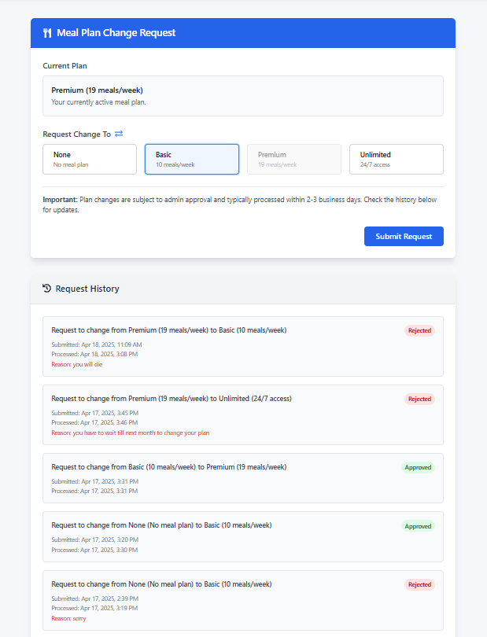
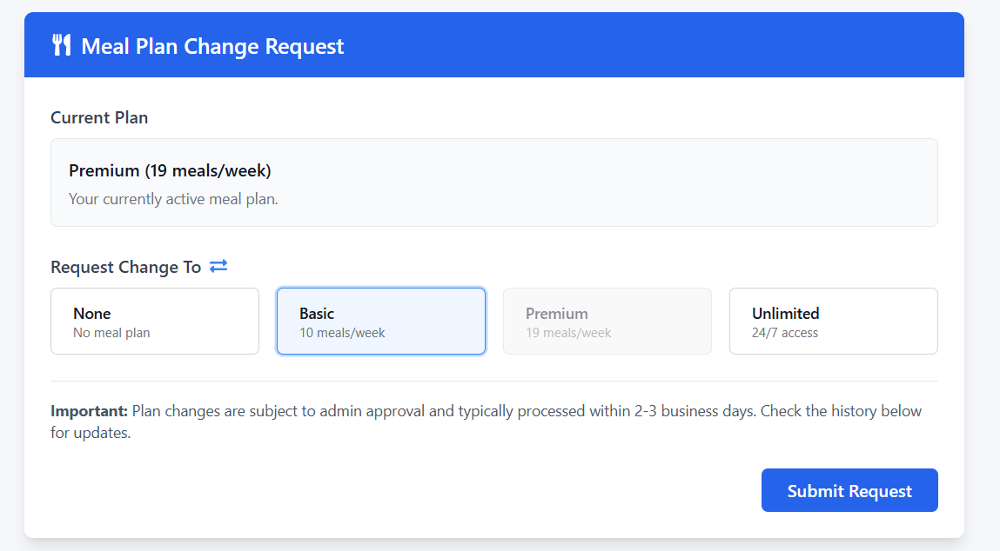
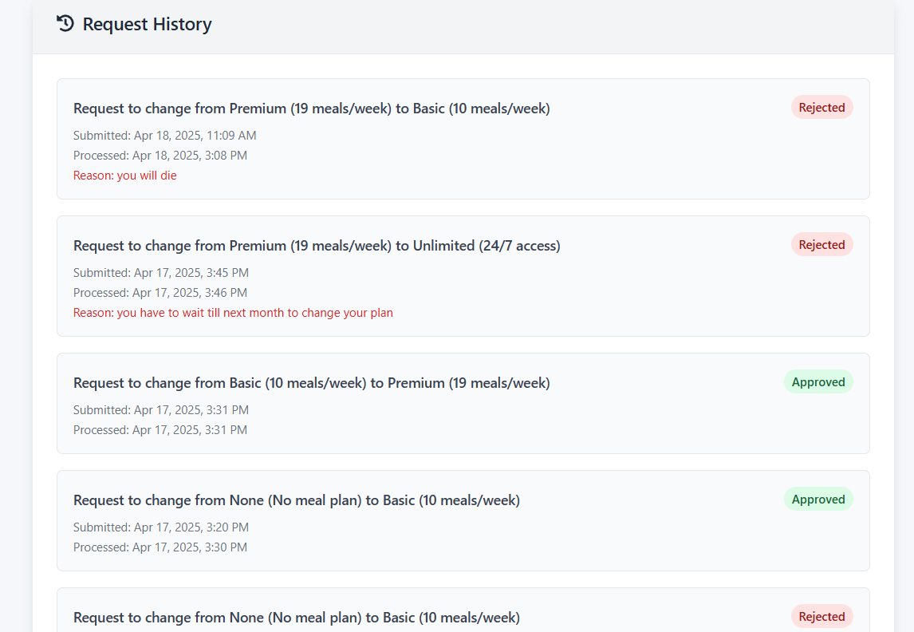

# Mess Subscription System

## 1. Overview

This page allows you to view your current meal plan, request changes to your meal plan, and track the status of your previous requests. You can select a new meal plan, submit a request for administrative approval, and check your request history.

---

## 2. Page Sections

The page is organized into the following sections:

### 2.1 Title Section

- **Header:** "Mess Subscription System" clearly identifies the page's purpose.

### 2.2 Current Plan Display

- Shows your currently active meal plan.
- **Purpose:** Lets you see which meal plan you currently have.

### 2.3 Request Change Section

- A selection of meal plan options (None, Basic, Premium, Unlimited).
- **Purpose:** Allows you to choose a new meal plan that differs from your current one.

### 2.4 Pending Request Notification (Conditional)

- This section appears _only if_ you have a meal plan change request that is still pending approval.
- It displays details about your pending request including the requested plan and submission date.
- **Purpose:** Informs you that you have an active request being processed.

### 2.5 Submit Request Button

- Used to submit your meal plan change request.
- **Purpose:** Sends your request to administrators for approval.

### 2.6 Request History Section

- A list of all your previous meal plan change requests.
- **Purpose:** Allows you to track the status of current and past requests.

---

## 3. How to Use the Page

Follow these steps to request a meal plan change:

### 3.1 View Current Plan

- When you access the page, your current meal plan is displayed in the "Current Plan" section.
- The display shows whether you have None, Basic (10 meals/week), Premium (19 meals/week), or Unlimited (24/7 access) plan.

### 3.2 Select a New Plan

- Click on one of the available meal plan options (None, Basic, Premium, Unlimited).
- Note that your current plan will be disabled and cannot be selected.
- Once selected, the meal plan option will be highlighted in blue.

### 3.3 Submit Your Request

- Click the "**Submit Request**" button.
- If the submission is successful, a success message will appear.
- Your request will now be pending approval by administrators.
- Note: While a request is pending, you cannot submit additional requests.

### 3.4 Check Request Status

- Scroll down to the "**Request History**" section at the bottom of the page.
- Your latest request will appear at the top of the list.
- Each request shows:
  - The change requested (from which plan to which plan)
  - Current status (Pending, Approved, or Rejected)
  - Submission date
  - Processing date (if processed)
  - Rejection reason (if rejected)

---

## 4. Important Notes & Troubleshooting

- **Plan Selection Required:** You must select a different meal plan than your current one before the Submit button becomes active.
- **Pending Request Limitation:** You can only have one pending request at a time. You must wait for current requests to be processed before submitting new ones.
- **Processing Time:** Requests typically take 2-3 business days to be processed by administrators.
- **Plan Implementation:** After approval, your new meal plan will generally take effect within 24 hours.
- **Status Colors:**
  - Pending (Yellow): Request is awaiting administrative review
  - Approved (Green): Request has been approved
  - Rejected (Red): Request has been denied (with reason provided)
- **Troubleshooting:**
  - If the "Submit Request" button is disabled, check that:
    - You've selected a different plan than your current one
    - You don't already have a pending request
  - If you can't see your request history, try refreshing the page
  - If error messages appear, follow any instructions provided or try again later
  - For persistent issues, contact the mess administration office

---

## 5. Meal Plan Options

| Plan          | Description       | Details                                  |
| ------------- | ----------------- | ---------------------------------------- |
| **None**      | No meal plan      | No access to mess facilities             |
| **Basic**     | 10 meals per week | Limited access to mess facilities        |
| **Premium**   | 19 meals per week | Access to most meals throughout the week |
| **Unlimited** | 24/7 access       | Unrestricted access to mess facilities   |

---

## 6. Frequently Asked Questions

**Q: How long will it take for my request to be processed?**  
A: Requests typically take 2-3 business days to be processed.

**Q: Can I cancel my pending request?**  
A: The system does not currently support canceling pending requests. Please contact the mess administration directly if needed.

**Q: When will my new meal plan take effect?**  
A: After approval, new meal plans generally take effect within 24 hours.

**Q: Why can't I select a new plan?**  
A: You cannot submit a new request if you already have a pending request, or if you're trying to select your current plan.

**Q: What happens if my request is rejected?**  
A: If your request is rejected, you'll see the reason in your request history. You can then submit a new request if needed.
