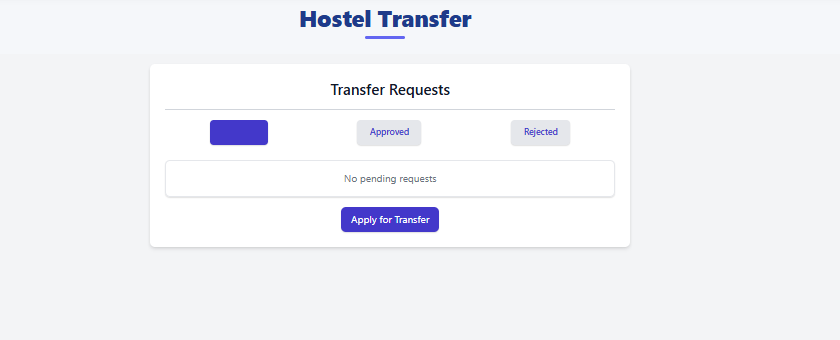
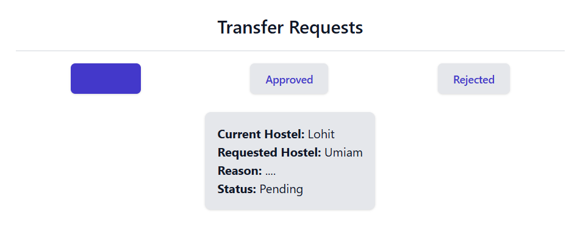
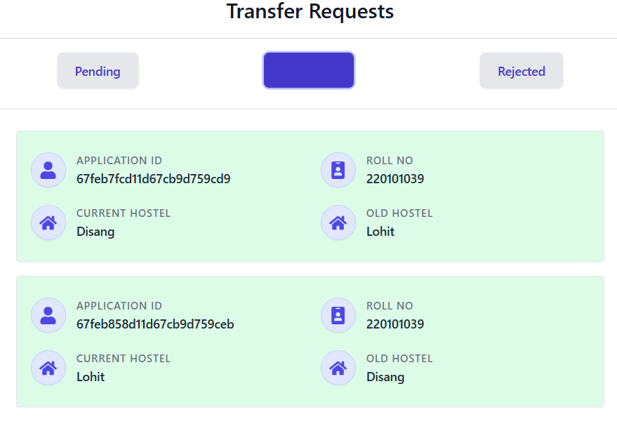

# Hostel Transfer Module

## 1. Overview

The **Transfer Requests** page allows you to manage hostel transfer applications. You can view your pending, approved, and rejected transfer requests, apply for a new hostel transfer by selecting your desired hostel, provide a reason for the transfer, and track the status of your applications.

---

## 2. Page Sections

The page is organized into the following sections:

### 2.1 Title Section

- **Header:** "Transfer Requests" clearly identifies the page's purpose.

### 2.2 Tab Navigation

- Three buttons labeled "Pending," "Approved," and "Rejected"
- **Purpose:** Allows you to switch between different views of your transfer requests based on their status.

### 2.3 Request Display Area

- Shows your requests based on the selected tab.
- **Purpose:** Provides a comprehensive view of all your transfer requests categorized by status.

### 2.4 Transfer Application Form (Conditional)

- This section appears _only when_ you click the "Apply for Transfer" button and have no pending requests.
- **Purpose:** Allows you to submit a new transfer request by selecting a hostel and providing a reason.

---

## 3. How to Use the Page

### 3.1 View Existing Requests

- When you first access the page, the "Pending" tab is selected by default.
- Use the tab buttons at the top to switch between views:
  - **Pending** - Shows requests awaiting approval
  - **Approved** - Shows requests that have been accepted
  - **Rejected** - Shows requests that have been denied
- Each request card displays relevant information based on its status.

### 3.2 Apply for a Transfer

- If you have no pending requests, a button labeled "Apply for Transfer" will appear at the bottom of the Pending tab.
- Click this button to open the transfer application form.
- The form will display your current hostel at the top.
- Select your desired hostel from the dropdown menu.
- Enter your reason for requesting a transfer in the text area.
- Click "Submit" to send your request or "Discard" to cancel.

### 3.3 Track Request Status

- After submission, your request will appear in the "Pending" tab.
- If your request is approved, it will move to the "Approved" tab.
- If your request is rejected, it will move to the "Rejected" tab with a reason.

---

## 4. Understanding Request Cards

Depending on the status, request cards display different information:

### 4.1 Pending Requests

- Current Hostel
- Requested Hostel
- Reason for transfer
- Status indication

### 4.2 Approved Requests

- Application ID
- Roll Number
- Current (new) Hostel
- Old Hostel

### 4.3 Rejected Requests

- Application ID
- Roll Number
- Current Hostel
- Requested Hostel
- Reason for Rejection

---

## 5. Important Notes & Troubleshooting

- **One Request Limit:** You can only have one pending transfer request at a time. You must wait for a decision on your current request before submitting a new one.
- **Hostel Options:** The available hostels in the dropdown are filtered based on your gender, excluding your current hostel.
- **Response Messages:** If you see a yellow message box at the bottom of the page, it indicates important information about your request submission. This might include errors or confirmation messages.
- **Form Not Appearing:** If the "Apply for Transfer" button is not visible, you likely already have a pending request.
- **Empty Tabs:** If a tab shows "No pending requests," "No approved requests," or "No rejected requests," you don't have any requests in that category.
